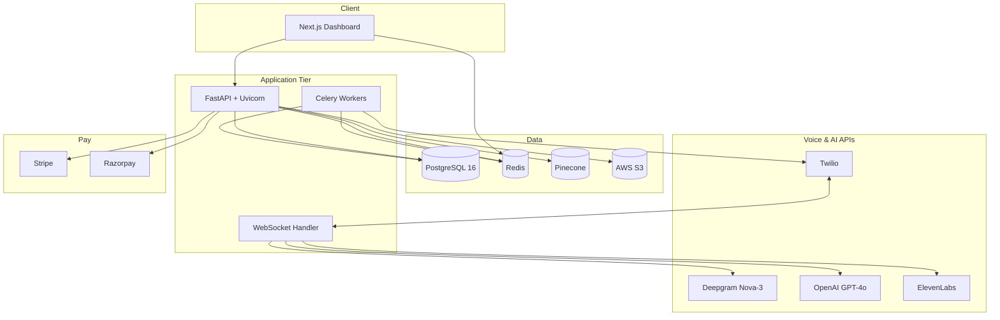
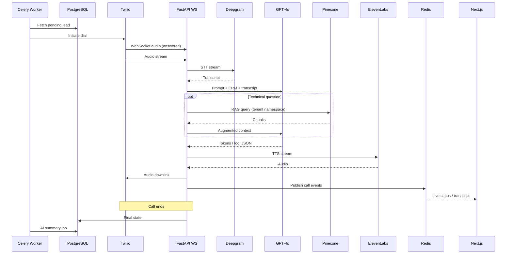

# CoderVu SalesAI — Technology Stack

**Version:** 1.1

---

## Table of Contents

1. [Stack Overview](#1-stack-overview)
2. [Layer-by-Layer Reference](#2-layer-by-layer-reference)
3. [Component Connectivity](#3-component-connectivity)
4. [Environment & Deployment](#4-environment--deployment)
5. [Future Scalability Upgrades](#5-future-scalability-upgrades)

---

## 1. Stack Overview

---

## 2. Layer-by-Layer Reference

### 2.1 Frontend Layer

| Technology | What It Does | Why Chosen | Alternatives Considered | Connects To |
|------------|--------------|------------|-------------------------|-------------|
| **Next.js 14+ (React 18)** | SSR/CSR dashboard, routing, API routes | Scalable SaaS UI, SEO for marketing pages, ecosystem fit | Vue/Nuxt, plain CRA | FastAPI REST, WebSocket/SSE, Stripe/Razorpay JS |
| **Tailwind CSS** | Utility-first styling | Rapid enterprise UI | CSS Modules, MUI alone | — |
| **shadcn/ui** *recommended* | Accessible component primitives | Pairs with Tailwind; common in Next SaaS | Ant Design | — |
| **Zustand** | Client state (UI, wizard flows) | Lightweight vs. Redux for dashboards | Redux Toolkit, Jotai | — |
| **TanStack Query (React Query)** | Server state cache, background refetch | Prevents API spam at scale | SWR (mentioned in PDF) | FastAPI |
| **React Flow** | Node-based flow builder UI | Listed for future drag-drop builder | Custom canvas | Deferred V2 |

### 2.2 Backend & Orchestration

| Technology | What It Does | Why Chosen | Alternatives Considered | Connects To |
|------------|--------------|------------|-------------------------|-------------|
| **Python 3.11+** | Primary backend language | Async ecosystem, team alignment in CoderVu PDFs | Node, Go | All services |
| **FastAPI** | REST APIs, webhooks, WebSockets | Native async; concurrent call handling | Django | PostgreSQL, Redis, external APIs |
| **Uvicorn** | ASGI server | Production FastAPI host | Gunicorn+Uvicorn workers | FastAPI app |
| **Celery** | Background jobs: dialer, summaries, retries, webhooks | Proven task queue | Dramatiq, ARQ | Redis broker, PostgreSQL |
| **SQLAlchemy** | ORM with tenant-scoped queries | Mature; connection pooling | Prisma N/A on Python | PostgreSQL |
| **Pydantic** *implied* | Request/response validation | FastAPI standard | — | — |

**Voice orchestration (MVP):** Custom **FastAPI** pipeline — Twilio ↔ WebSocket ↔ Deepgram Nova-3 ↔ GPT-4o ↔ ElevenLabs — implemented in engineering Weeks 5–7.

### 2.3 Data Layer

| Technology | What It Does | Why Chosen | Alternatives Considered | Connects To |
|------------|--------------|------------|-------------------------|-------------|
| **PostgreSQL 16** | Tenants, users, leads, campaigns, billing, call logs | RLS-ready, transactional multi-tenant | — | FastAPI, Celery |
| **Redis** | Celery broker, pub/sub for live call events, caching | Low-latency pub/sub for UI | RabbitMQ, Kafka *(future)* | FastAPI, Next.js subscribers |
| **Pinecone** | Vector store for RAG per `tenant_id` namespace | Serverless scale, namespace isolation | **Qdrant** *(AI-Voice alt)*, Weaviate | OpenAI embeddings, FastAPI |
| **AWS S3** | Call recordings (MP3), uploaded PDFs | Durable object storage | GCS, MinIO | Celery post-call, frontend playback |

**Hosting options (from Dev Flow):** AWS RDS or Supabase for PostgreSQL; AWS ElastiCache for Redis.

### 2.4 Voice & AI Pipeline

| Technology | What It Does | Why Chosen | Alternatives Considered | Connects To |
|------------|--------------|------------|-------------------------|-------------|
| **Twilio** | Phone numbers, outbound dial, bidirectional audio stream | Industry standard telephony | Plivo, Vonage | FastAPI webhooks/WebSocket |
| **Deepgram Nova-3** | Real-time STT, streaming | Low latency; Hinglish/accent handling per PDF | Whisper live, AssemblyAI | FastAPI audio pipe |
| **OpenAI GPT-4o** | Dialog reasoning, tool calls, summarization | Primary LLM in CoderVu PDFs | **Gemini 1.5 Pro** *(AI-Voice)*, **Anthropic** *(Dev Flow)* | Pinecone, FastAPI tools |
| **ElevenLabs Turbo v2.5** | Streaming TTS | Sub-400ms segment latency target | PlayHT, Azure TTS | WebSocket to Twilio |
| **OpenAI Embeddings** | PDF chunk → vector | Integrated with GPT ecosystem | Cohere embed | Pinecone |
| **OpenAI Whisper** | STT failover | Fault tolerance when Deepgram down | — | FastAPI |

### 2.5 Billing & Auth

| Technology | What It Does | Why Chosen | Alternatives Considered |
|------------|--------------|------------|-------------------------|
| **JWT** | API authentication | Stated in MVP scope | Session cookies only |
| **Stripe** | International subscriptions | Source docs | PayPal |
| **Razorpay** | Domestic / GST India | Source docs | — |

### 2.6 DevOps & Infrastructure

| Technology | What It Does | Why Chosen |
|------------|--------------|------------|
| **GitHub + branch protection** | Source control | Dev Flow handoff checklist |
| **GitHub Actions** | CI: Black/Ruff, Prettier, pytest | Block broken deploys |
| **Docker** | Container images for API, worker, frontend | Rolling updates |
| **AWS ECR** | Image registry | Source docs |
| **AWS ECS or Kubernetes** | Orchestration; rolling updates without dropping calls | Source docs |

---

## 3. Component Connectivity

### 3.1 Outbound Call Sequence

### 3.2 Multi-Tenant Isolation Points

| Layer | Mechanism |
|-------|-----------|
| PostgreSQL | `tenant_id` on all tables; middleware enforces ORM filters |
| Pinecone | Namespace = `tenant_id` |
| Twilio inbound | Map "To" number → tenant → load prompt/voice/tools/KB |
| S3 | Prefix per tenant *recommended* |
| JWT | Claims include `tenant_id` and `role` |

---

## 4. Environment & Deployment

### 4.1 Environment Variables (Handoff Checklist)

| Variable Group | Keys |
|----------------|------|
| Telephony | `TWILIO_*` |
| Voice AI | `DEEPGRAM_*`, `OPENAI_*`, `ELEVENLABS_*` |
| RAG | `PINECONE_*` |
| Data | `DATABASE_URL`, `REDIS_URL` |
| Storage | `AWS_S3_*` |
| Billing | `STRIPE_*`, `RAZORPAY_*` |
| App | `JWT_SECRET`, `ENV`, `ALLOWED_ORIGINS` |

### 4.2 Deployment Topology (MVP)

| Service | Container | Scaling |
|---------|-----------|---------|
| `api` | FastAPI + Uvicorn | Horizontal for WebSockets |
| `worker` | Celery | Horizontal by queue depth |
| `web` | Next.js | Static/SSR tier |
| `redis` | Managed | Cluster later |
| `postgres` | RDS/Supabase | Read replicas later |

### 4.3 Rolling Update Requirement

Deployments **must not** drop active Twilio WebSockets. Use rolling updates on ECS/K8s with connection draining *recommended*.

---

## 5. Future Scalability Upgrades

| Trigger | Upgrade | Benefit |
|---------|---------|---------|
| Mass campaign spikes | Redis → **Apache Kafka** | Zero message loss at 9 AM batch |
| High concurrent calls | EC2 Docker → **Amazon EKS** | Auto-scale WebSocket pods |
| Billions of lead rows | PostgreSQL → **Citus sharding** by `tenant_id` | Query performance |
| High LLM cost | GPT-4o → **self-hosted Llama 3** for summaries/intent | Cost reduction |

These are **not** MVP requirements.

---

*End of document*
