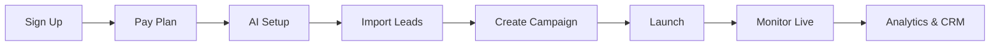
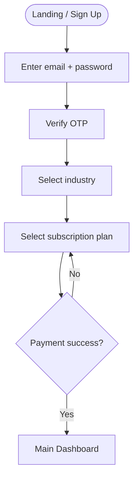
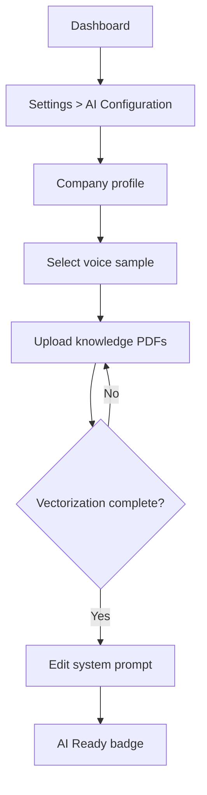
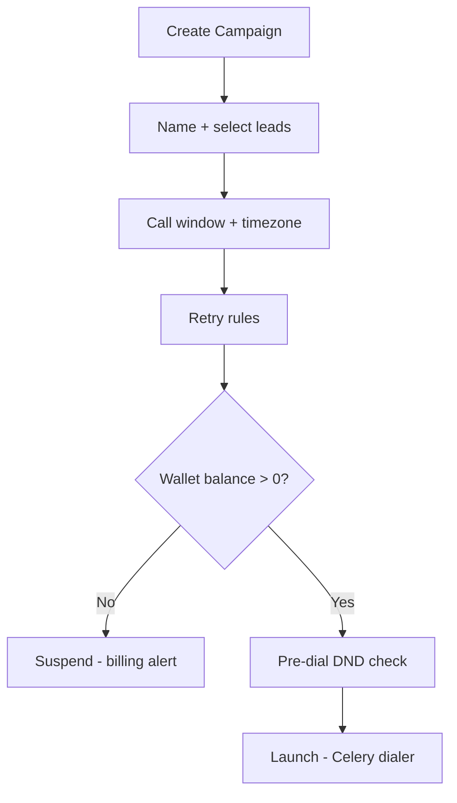
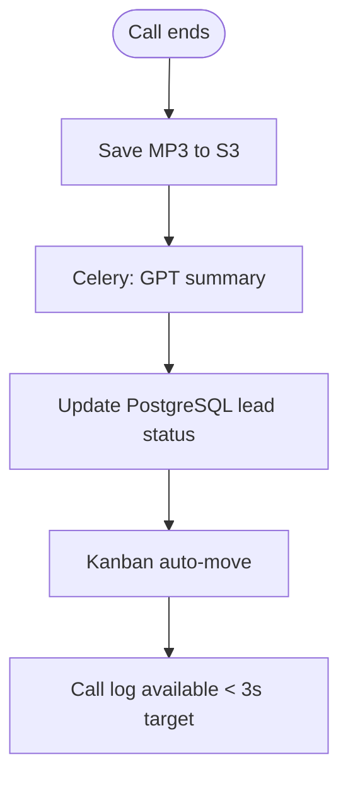
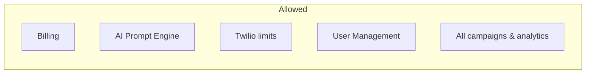
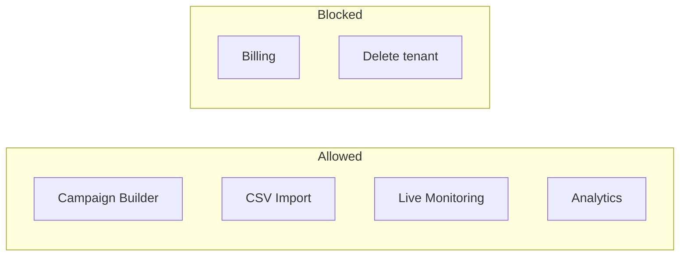
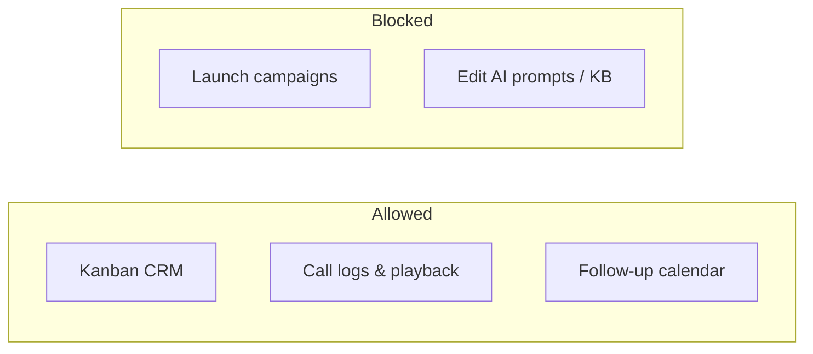
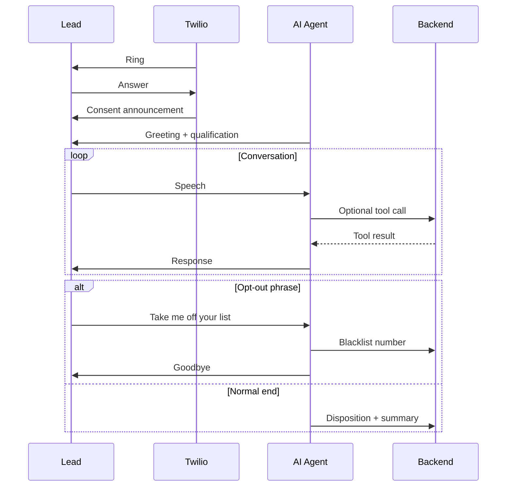

# CoderVu SalesAI — User Flow Document

**Version:** 1.0 | **Personas:** Business Owner, Campaign Manager, Sales Rep, Platform Super Admin

---

## Table of Contents

1. [Journey Overview](#1-journey-overview)
2. [Primary Journey: Business Owner Launch](#2-primary-journey-business-owner-launch)
3. [Role-Based Flows](#3-role-based-flows)
4. [System-Side Flows](#4-system-side-flows)
5. [Edge Cases & Error Paths](#5-edge-cases--error-paths)
6. [UI Screen Inventory](#6-ui-screen-inventory)

---

## 1. Journey Overview

CoderVu SalesAI onboarding is **gated**: users cannot launch campaigns without business context (RAG), AI configuration, and billing.

| Phase | Gate | Unlocks |
|-------|------|---------|
| Registration | Email + OTP + plan payment | Dashboard |
| AI Setup | Voice + KB + prompt | Campaign creation |
| Leads | CSV import | Campaign audience |
| Campaign | Window + retry rules | Live dialing |
| Post-call | Auto disposition | Rep follow-up |

---

## 2. Primary Journey: Business Owner Launch

### 2.1 Phase 0 — Registration & Onboarding

| Step | User Action | System Response |
|------|-------------|-----------------|
| 0.1 | Open Sign Up | Render email/password form |
| 0.2 | Submit credentials | Send OTP; create tenant stub |
| 0.3 | Verify OTP | Activate account |
| 0.4 | Select industry (e.g., IT Training, Real Estate) | Assign **baseline industry prompt** to tenant |
| 0.5 | Choose plan (Basic / Pro / Enterprise) | Show Stripe/Razorpay modal |
| 0.6 | Complete payment | Webhook activates subscription; redirect to dashboard |

### 2.2 Phase 1 — Business & Agent Setup

**Screen:** Settings → AI Configuration

| Step | User Action | System Response |
|------|-------------|-----------------|
| 1.1 | Enter company name, website, timezone | Save tenant profile |
| 1.2 | Preview and select ElevenLabs voice (e.g., Neha) | Store `voice_id` |
| 1.3 | Upload PDFs: syllabi, pricing, FAQs | Chunk + embed → Pinecone (`tenant_id` namespace); show spinner |
| 1.4 | Edit custom system prompt | Validate length; version in DB |
| 1.5 | Configure Twilio limits *if exposed* | Store telephony caps |

### 2.3 Phase 2 — Lead Pipeline Creation

**Screen:** Leads → Import

| Step | User Action | System Response |
|------|-------------|-----------------|
| 2.1 | Download CSV template | Serve template file |
| 2.2 | Upload CSV (Name, Phone, Email, Notes) | Column mapping UI |
| 2.3 | Confirm import | Insert leads → **Pending Queue** |
| 2.4 | View Kanban | Display columns: Pending, Connected, Converted, etc. |

### 2.4 Phase 3 — Campaign Launch

**Screen:** Campaigns → Create New

| Step | User Action | System Response |
|------|-------------|-----------------|
| 3.1 | Name campaign (e.g., Q3 React Bootcamp) | Create campaign record |
| 3.2 | Select lead list | Link leads to campaign |
| 3.3 | Set call window (e.g., 10:00–17:00 IST) | Store schedule rules |
| 3.4 | Set retry logic (e.g., Busy → 30 min, 1 retry) | Store retry policy |
| 3.5 | Click **Launch Campaign** | Celery enqueues dials; respect concurrency limits |

### 2.5 Phase 4 — Live Call Monitoring

**Screen:** Campaigns → Active View

| Step | User Action | System Response |
|------|-------------|-----------------|
| 4.1 | Open active campaign | Table of leads with live status |
| 4.2 | Observe row turns green | `Connected` via Redis pub/sub |
| 4.3 | Click **Inspect** on active call | Real-time transcript stream (Deepgram → Redis → UI) |
| 4.4 | Wait for completion | Row updates disposition |

### 2.6 Phase 5 — Analytics & CRM Dispositions

**Screen:** Call Logs & CRM Dashboard

| Step | User Action | System Response |
|------|-------------|-----------------|
| 5.1 | View Kanban auto-move | e.g., Pending → Appointment Booked / Not Interested |
| 5.2 | Open lead card | AI summary, intent, S3 audio player |
| 5.3 | Rep schedules follow-up | Calendar entry *recommended* |

---

## 3. Role-Based Flows

### 3.1 Business Owner (Admin)

| Capability | Allowed | Blocked |
|------------|---------|---------|
| Billing & subscription | ✅ | — |
| AI prompt & KB | ✅ | — |
| Launch campaigns | ✅ | — |
| Delete tenant | ✅ *recommended audit* | — |

### 3.2 Campaign Manager

### 3.3 Sales Representative

### 3.4 Platform Super Admin *recommended*

| Capability | Purpose |
|------------|---------|
| Tenant impersonation *recommended* | Support debugging |
| Global DND registry management | Compliance |
| Usage & abuse monitoring | Platform health |

---

## 4. System-Side Flows

### 4.1 End-Customer (Lead) Call Experience

### 4.2 Inbound Call Routing (Multi-Tenant)

| Step | Behavior |
|------|----------|
| 1 | Twilio receives call to tenant's number |
| 2 | Webhook resolves tenant by **To** number |
| 3 | Load tenant prompt, voice, tools, Pinecone namespace |
| 4 | Start same STT/LLM/TTS loop |

*From AI-Voice PDF — applies when inbound numbers are provisioned.*

---

## 5. Edge Cases & Error Paths

| Scenario | User-Visible Behavior | Backend Behavior |
|----------|----------------------|------------------|
| Payment fails at signup | Stay on plan selection | No tenant activation |
| KB upload fails | Error toast; retry | No partial namespace publish |
| Launch with $0 wallet | Campaign suspended modal | Block Celery dial |
| DND match | Lead skipped | Log skip reason |
| Lead busy | Retry per campaign rules | Reschedule Celery |
| User interrupts AI | Transcript shows overlap | Flush TTS + cancel LLM |
| STT outage | Brief pause or fallback voice | Whisper failover |
| AI low confidence | Spoken escalation script | Log confidence flag |
| Abusive lead | Call ended politely | Tag Spam/Abusive |
| Deploy during call | No user action | Rolling drain WebSockets |

---

## 6. UI Screen Inventory

| Screen | Primary Persona | MVP |
|--------|-----------------|-----|
| Sign Up / OTP | Owner | ✅ |
| Plan & Payment | Owner | ✅ |
| Dashboard Home | All | ✅ |
| Settings → AI Configuration | Owner | ✅ |
| Leads → Import | Manager | ✅ |
| Leads → Kanban | Rep, Manager | ✅ |
| Campaigns → Create | Manager | ✅ |
| Campaigns → Active View | Manager | ✅ |
| Call Logs | Rep, Manager | ✅ |
| Analytics | Owner, Manager | ✅ |
| Billing | Owner | ✅ |
| User Management | Owner | ✅ |
| Flow Builder | Owner | V2 |

---

*End of document*
