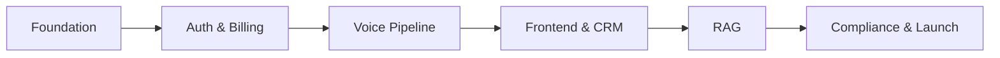
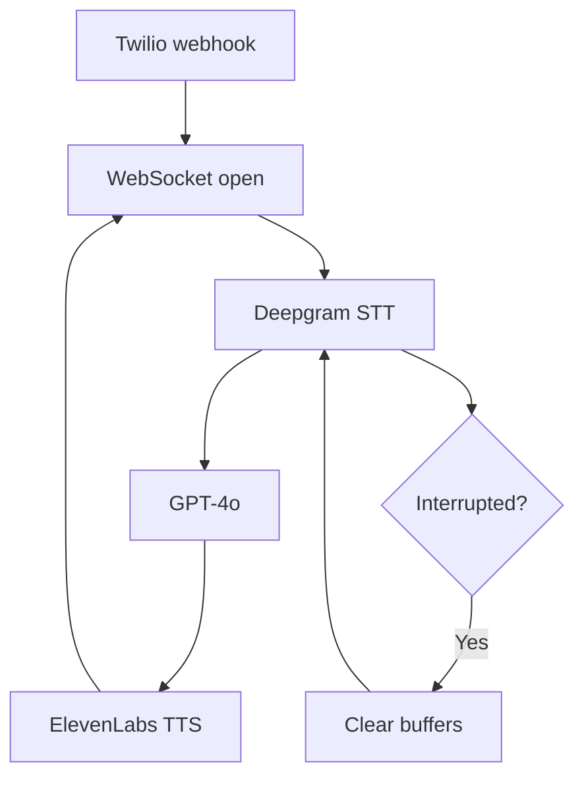
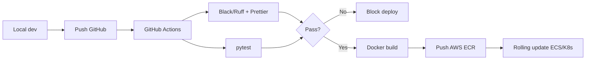

# CoderVu SalesAI — Development Flow Document

**Version:** 1.0 | **Timeline:** 12 weeks to MVP | **Stack:** Python FastAPI + Next.js

---

## Table of Contents

1. [Principles](#1-principles)
2. [Phase Overview](#2-phase-overview)
3. [Detailed Phase Plan](#3-detailed-phase-plan)
4. [Branching Strategy](#4-branching-strategy)
5. [CI/CD Pipeline](#5-cicd-pipeline)
6. [Testing Strategy](#6-testing-strategy)
7. [Deployment & Monitoring](#7-deployment--monitoring)
8. [Team Responsibilities](#8-team-responsibilities)
9. [Handoff Checklist](#9-handoff-checklist)

---

## 1. Principles

| Principle | Rationale |
|-----------|-----------|
| **Sequential phases** | Voice pipeline depends on tenant DB, auth, and queues |
| **No frontend-before-foundation** | Prevents data leaks and broken WebSocket contracts |
| **Voice phase is highest risk** | Weeks 5–7 dedicated; Phases 1–2 must be stable |
| **GitOps with quality gates** | Failed tests block production |
| **Zero-downtime deploys** | Active Twilio WebSockets must not drop |

---

## 2. Phase Overview

| Phase | Name | Weeks | Goal |
|-------|------|-------|------|
| 0 | Foundation & Multi-Tenant Infrastructure | 1–2 | Schema, middleware, Redis/Celery |
| 1 | Auth & SaaS Core | 3–4 | JWT, RBAC, Stripe/Razorpay |
| 2 | AI Voice Pipeline | 5–7 | Twilio, WebSocket, STT/LLM/TTS |
| 3 | React Frontend & CRM | 8–9 | Next.js, Kanban, campaigns |
| 4 | RAG & Advanced Intelligence | 10–11 | Pinecone, embeddings, tools |
| 5 | Compliance, QA & Launch | 12 | DND, load test, E2E UAT |

---

## 3. Detailed Phase Plan

### Phase 0: Foundation (Weeks 1–2)

| Deliverable | Acceptance |
|-------------|------------|
| Monorepo / service layout | API, worker, web separated |
| PostgreSQL schema | `tenant_id` on every business table |
| FastAPI tenant middleware | Requests without tenant context rejected |
| Redis + Celery skeleton | Sample task runs E2E |
| Docker Compose local *recommended* | One-command dev environment |
| Migration tooling | Alembic or equivalent configured |

**Exit criteria:** CRUD on tenant-scoped entity; Celery task logged with `tenant_id`.

---

### Phase 1: Auth & SaaS Core (Weeks 3–4)

| Deliverable | Acceptance |
|-------------|------------|
| JWT auth (login, refresh) | Role claims embedded |
| RBAC | Super Admin, Business Owner, Campaign Manager, Sales Rep |
| Business config CRUD | Company profile, timezone |
| Stripe integration | Subscription create/cancel webhooks |
| Razorpay integration | Domestic payment webhooks |
| Account activation | Payment webhook enables tenant features |

**Exit criteria:** Owner can pay and access dashboard; Manager blocked from billing APIs.

---

### Phase 2: AI Voice Pipeline (Weeks 5–7) — Critical Path

#### Step 2.1 — Telephony Webhooks (Week 5)

| Task | Detail |
|------|--------|
| Provision Twilio number | Per tenant or shared pool *decision* |
| Inbound/outbound webhook routes | FastAPI validates Twilio signature |
| Call state machine | ringing → connected → completed |

#### Step 2.2 — WebSocket Server (Week 5–6)

| Task | Detail |
|------|--------|
| Bidirectional WebSocket | Audio bytes in/out |
| Connection registry | Map CallSid → tenant + campaign |

#### Step 2.3 — AI Orchestration (Week 6–7)

| Task | Detail |
|------|--------|
| Deepgram streaming STT | Pipe Twilio audio |
| GPT-4o dialog | Prompt + CRM context |
| ElevenLabs streaming TTS | Return audio to Twilio |
| Tool call handler | POST to internal routes |

#### Step 2.4 — Interruption Handling (Week 7)

| Task | Detail |
|------|--------|
| Clear buffer command | ElevenLabs + Twilio |
| Cancel in-flight LLM | On semantic barge-in |
| Semantic turn-taking *recommended* | Reduce false interrupts from noise |

**Exit criteria:** Manual test call completes qualification script; interrupt handled gracefully.

---

### Phase 3: Frontend & CRM (Weeks 8–9)

| Deliverable | Acceptance |
|-------------|------------|
| Next.js app shell | Auth guard, layout, navigation |
| CSV lead import | Column mapping + validation |
| Kanban board | Pipeline states from requirements |
| Campaign builder | Window, retries, launch button |
| Call log viewer | Audio player + transcript |
| Live monitoring | Redis subscription → UI updates |

**Exit criteria:** Import → launch → see live status → view post-call log.

---

### Phase 4: RAG & Intelligence (Weeks 10–11)

| Step | Task |
|------|------|
| 4.1 | Pinecone integration; upload API |
| 4.2 | PDF chunking + OpenAI embeddings → `tenant_id` namespace |
| 4.3 | Mid-call RAG query in voice loop |
| 4.4 | Extend LLM tools for `search_knowledge` |

**Exit criteria:** Technical question answered from uploaded PDF without hallucinated fees.

---

### Phase 5: Compliance, QA & Launch (Week 12)

| Task | Detail |
|------|--------|
| DND engine | Pre-dial checks |
| Load test | 50 concurrent WebSockets |
| E2E UAT | Import → Campaign → Call → CRM → Bill |
| Runbook | On-call, rollback, API key rotation |

**Exit criteria:** Full funnel passes UAT; load test report signed off.

---

## 4. Branching Strategy

| Branch | Purpose | Rules |
|--------|---------|-------|
| `main` | Production | Protected; PR only |
| `staging` | Pre-production integration | Protected |
| `feature/*` | Phase deliverables | PR → staging |
| `hotfix/*` | Production fixes | PR → main + staging |

**Recommended PR checklist:**
- Unit tests pass
- Migration included if schema change
- No secrets in diff
- Tenant isolation test for data changes

---

## 5. CI/CD Pipeline

| Stage | Tools | Failure Action |
|-------|-------|----------------|
| Lint Python | Black, Ruff | Fail pipeline |
| Lint JS | Prettier | Fail pipeline |
| Unit tests | pytest | Fail pipeline |
| Build | Docker multi-stage | Fail pipeline |
| Deploy | ECS/K8s rolling | Rollback on health check fail |

**Critical:** Configure readiness probes that respect active WebSocket count *recommended*.

---

## 6. Testing Strategy

| Level | Scope | Phase Introduced |
|-------|-------|------------------|
| **Unit** | Middleware, retry logic, prompt validators | Phase 0+ |
| **Integration** | Webhooks, DB, Redis, mocked Twilio | Phase 2+ |
| **Contract** | Twilio/OpenAI payload shapes | Phase 2 |
| **Voice simulation** | Manual + recorded audio fixtures | Phase 2–7 |
| **E2E** | Full business funnel | Phase 12 |
| **Load** | 50 concurrent WS | Phase 12 |

### Voice-Specific Test Cases (From AI-Voice PDF)

| Case | Expected |
|------|----------|
| Interrupt mid-sentence | AI stops, answers new question |
| Heavy accent / Hinglish | STT accuracy acceptable |
| Off-topic questions | Guardrails trigger |
| Silence | Prompt twice, end call |
| Wrong pricing question | No invented fees; escalation script |

---

## 7. Deployment & Monitoring

### 7.1 Environments

| Env | Purpose |
|-----|---------|
| `local` | Docker Compose |
| `staging` | Full external sandboxes (Twilio test, Stripe test) |
| `production` | Live keys, monitored |

### 7.2 Monitoring *recommended extensions*

| Signal | Tool *suggested* |
|--------|------------------|
| API latency / errors | CloudWatch / Datadog |
| WebSocket active count | Custom metric |
| Celery queue depth | Redis exporter |
| STT/LLM/TTS latency | Per-stage timestamps |
| Cost per tenant | Billing aggregator job |

### 7.3 Alerting

| Alert | Threshold |
|-------|-----------|
| WebSocket error rate | > 5% in 5 min |
| Celery backlog | > N tasks for 10 min |
| STT failover spike | Anomaly detection *recommended* |

---

## 8. Team Responsibilities

| Role | Phase 0–1 | Phase 2 | Phase 3–4 | Phase 5 |
|------|-----------|---------|-----------|---------|
| **Tech Lead** | Schema review, tenant security | Voice architecture | Integration review | Launch sign-off |
| **Backend Engineer** | FastAPI, Celery, billing | Twilio, WS, AI pipe | RAG APIs | DND, retries |
| **Frontend Engineer** | Auth UI stub | Live monitor components | CRM, campaigns | UAT support |
| **AI/Prompt Engineer** | — | Prompt v1, eval scripts | RAG content, tools | Edge case tuning |
| **DevOps** | CI/CD, RDS, Redis | WS scaling config | S3 policies | Load test |
| **QA** | Test plans | Voice test matrix | Regression | E2E UAT |

---

## 9. Handoff Checklist

Before Phase 0 coding starts, confirm:

| # | Item | Owner |
|---|------|-------|
| 1 | GitHub org + branch protection | Tech Lead |
| 2 | AWS account + IAM | DevOps |
| 3 | API keys in secure `.env` store | Tech Lead |
| 4 | PostgreSQL hosted (RDS/Supabase) | DevOps |
| 5 | Redis hosted (ElastiCache) | DevOps |
| 6 | Twilio, Deepgram, OpenAI, ElevenLabs, Pinecone accounts | Backend |
| 7 | Stripe + Razorpay sandboxes | Backend |

**Gate:** No development until all items checked (from Development Flow PDF).

---

*End of document*
