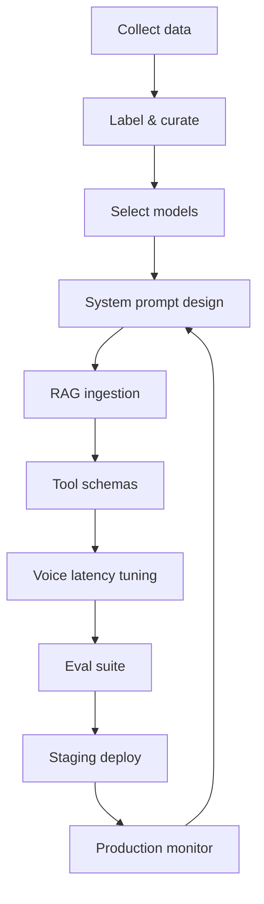
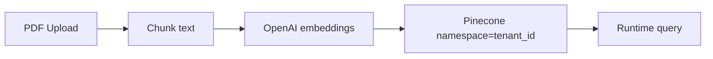
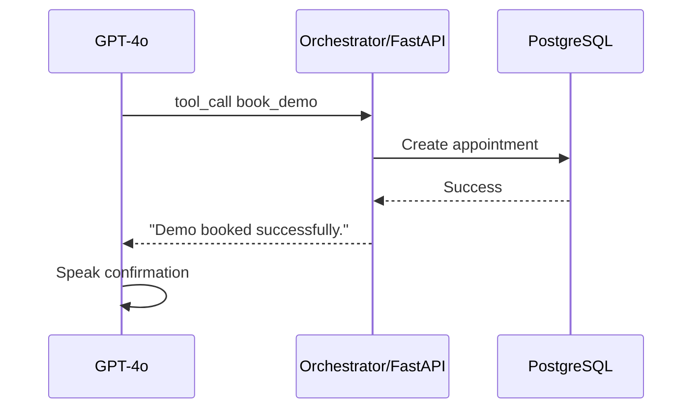

# CoderVu SalesAI — AI Training & Grounding Document

**Version:** 1.0 | **Approach:** In-context learning + RAG + tool calling (not weight fine-tuning for MVP)

---

## Table of Contents

1. [Philosophy](#1-philosophy)
2. [Training Pipeline Overview](#2-training-pipeline-overview)
3. [Step 0: Prerequisites](#3-step-0-prerequisites)
4. [Step 1: Data Collection](#4-step-1-data-collection)
5. [Step 2: Labeling & Curation](#5-step-2-labeling--curation)
6. [Step 3: Model Selection](#6-step-3-model-selection)
7. [Step 4: Behavioral Training (System Prompt)](#7-step-4-behavioral-training-system-prompt)
8. [Step 5: Knowledge Training (RAG)](#8-step-5-knowledge-training-rag)
9. [Step 6: Action Training (Function Calling)](#9-step-6-action-training-function-calling)
10. [Step 7: Voice-Specific Tuning](#10-step-7-voice-specific-tuning)
11. [Step 8: Evaluation](#11-step-8-evaluation)
12. [Step 9: Deployment & Monitoring](#12-step-9-deployment--monitoring)
13. [Step 10: Prompt Engineering & Safety](#13-step-10-prompt-engineering--safety)
14. [Master Checklists](#14-master-checklists)

---

## 1. Philosophy

Modern voice agents for CoderVu SalesAI **do not require LLM weight fine-tuning** for MVP (from AI-Voice PDF). Instead:

| Technique | Trains What |
|-----------|-------------|
| **System prompt** | Persona, guardrails, conversation state machine |
| **RAG** | Factual product knowledge (syllabi, pricing PDFs, FAQs) |
| **Function calling** | CRM actions (book demo, check availability) |
| **Voice stack tuning** | Latency, interruption, accent handling |

Post-MVP *recommended*: fine-tune smaller models for summarization/intent only (Tech Stack future roadmap).

---

## 2. Training Pipeline Overview



---

## 3. Step 0: Prerequisites

| Checklist Item | Status |
|----------------|--------|
| Tenant `tenant_id` provisioned | ☐ |
| Pinecone index + namespace strategy defined | ☐ |
| OpenAI, Deepgram, ElevenLabs API keys | ☐ |
| Sample calls recorded for eval *recommended* | ☐ |
| Text-chat sandbox for prompt iteration (orchestrator or internal) | ☐ |

---

## 4. Step 1: Data Collection

### 4.1 Knowledge Documents (RAG)

| Source | Format | Owner |
|--------|--------|-------|
| Course syllabi | PDF | Tenant admin |
| Pricing sheets | PDF | Tenant admin |
| FAQs | PDF, CSV, MD | Tenant admin |
| Objection handlers | MD *recommended* | Sales team |
| Website copy | URL scrape *recommended* | Automated job |

### 4.2 Conversational Data *recommended*

| Source | Use |
|--------|-----|
| Historical human sales calls (transcripts) | Prompt few-shot examples |
| Synthetic dialogs | Edge case coverage |
| Failed AI call logs | Regression tests |

### 4.3 CRM Context Fields

| Field | Injected Into Prompt |
|-------|---------------------|
| Lead name | Personalization |
| Lead notes | Custom context |
| Pipeline stage | Strategy selection |
| Industry template | Baseline script |

---

## 5. Step 2: Labeling & Curation

| Activity | Description |
|----------|-------------|
| **Chunk review** | Verify PDF splits don't break tables/pricing |
| **Intent labels** | Tag transcripts: qualified, not interested, booked demo |
| **Objection tags** | Price, timing, competitor, technical |
| **Toxicity labels** | Abuse samples for guardrail tests |
| **Ground truth answers** | Approved answers for eval questions |

### Labeling Checklist

- [ ] Remove PII from training eval sets where not needed  
- [ ] Mark outdated pricing docs as deprecated  
- [ ] Version knowledge uploads per tenant  
- [ ] Document approved fee figures (never hallucinate)

---

## 6. Step 3: Model Selection

| Role | Technology | Notes |
|------|------------|-------|
| STT | Deepgram Nova-3 | OpenAI Whisper as automatic failover |
| LLM (dialog) | GPT-4o | Anthropic as approved alternate |
| TTS | ElevenLabs Turbo v2.5 | Sub-400ms segment latency target |
| Embeddings | OpenAI embeddings | `text-embedding-3-*` into Pinecone |
| Summarization post-call | GPT-4o | Self-hosted Llama 3 *future* cost optimization |

### Selection Criteria

| Criterion | Weight |
|-----------|--------|
| End-to-end latency | High |
| Hinglish / accent accuracy | High (CoderVu market) |
| Tool calling reliability | High |
| Cost per minute | Medium |
| Data residency | Medium *assumption* |

---

## 7. Step 4: Behavioral Training (System Prompt)

### 7.1 Prompt Structure

```text
## Role & Persona
You are Neha, a senior admissions counselor for CoderVu...

## Guardrails
- Never invent course fees.
- If unknown technical detail: "Let me have a senior developer email you..."

## State Machine
1. Qualify: student vs professional
2. Pitch relevant module (e.g., Python/React full-stack track)
3. Offer free demo booking

## Tools Available
- book_demo(date, time)
- check_seat_availability(course)
- search_knowledge(query)

## Tone
Friendly, professional, moderate pace.
```

### 7.2 Development Process

| Step | Action |
|------|--------|
| 1 | Start with **text-chat only** (no voice) per AI-Voice PDF |
| 2 | Test state machine order rigorously |
| 3 | Add guardrail adversarial prompts |
| 4 | Promote to voice only after text passes |

### 7.3 Checklist

- [ ] Persona defined  
- [ ] Guardrails for pricing and unknowns  
- [ ] State machine with explicit transitions  
- [ ] Opt-out phrase handling documented in prompt  
- [ ] Escalation script for low confidence  

---

## 8. Step 5: Knowledge Training (RAG)

### 8.1 Ingestion Pipeline



| Step | Implementation |
|------|----------------|
| Upload | Tenant UI → S3 + metadata in PostgreSQL |
| Chunk | Python: 500–1000 token chunks with overlap *recommended* |
| Embed | OpenAI `text-embedding-3-*` |
| Store | Pinecone upsert with metadata: `doc_id`, `page`, `source` |
| Query | Top-k retrieval on technical questions mid-call |

### 8.2 RAG Checklist

- [ ] Namespace strictly equals `tenant_id`  
- [ ] Re-ingest on document update  
- [ ] Citations logged internally *recommended*  
- [ ] Test: "What is the React bootcamp fee?" returns doc text only  
- [ ] Empty retrieval → escalation script, not invention  

---

## 9. Step 6: Action Training (Function Calling)

### 9.1 Example Tool Schema (From Source)

```json
{
  "name": "book_demo",
  "description": "Book a free demo session for the lead",
  "parameters": {
    "type": "object",
    "properties": {
      "date": { "type": "string", "format": "date" },
      "time": { "type": "string" }
    },
    "required": ["date", "time"]
  }
}
```

### 9.2 Backend Flow



### 9.3 Tool Catalog *from source + logical extension*

| Tool | Purpose |
|------|---------|
| `book_demo` | Schedule demo |
| `check_seat_availability` | Course capacity |
| `search_knowledge` | Explicit RAG pull |
| `update_lead_status` | CRM disposition |
| `blacklist_number` | Opt-out compliance |

All tool handlers execute against **FastAPI + PostgreSQL** (tenant-scoped).

### 9.4 Checklist

- [ ] JSON schemas registered with orchestrator  
- [ ] Idempotent webhook handlers  
- [ ] Error messages safe to speak aloud  
- [ ] Timeout handling (< 2s tool SLA *recommended*)  

---

## 10. Step 7: Voice-Specific Tuning

### 10.1 Latency Budget

| Stage | Target |
|-------|--------|
| Deepgram STT | ~200ms to first transcript *from source* |
| LLM first token | Minimal prompt size; stream tokens |
| ElevenLabs TTS | Sub-400ms to first audio *from source* |
| **Total E2E** | < 800ms |

### 10.2 Streaming Configuration

| Setting | Requirement |
|---------|-------------|
| LLM | Stream tokens; don't wait for full paragraph |
| TTS | Send first sentence early |
| STT | Word-by-word partials |

### 10.3 Interruption Handling

| Mode | Behavior |
|------|----------|
| Legacy VAD | ❌ Avoid — false stops on noise |
| Semantic turn-taking *recommended* | ✅ Cut TTS, cancel LLM, process real interrupt |

### 10.4 Voice Checklist

- [ ] ElevenLabs voice ID selected per tenant  
- [ ] Speaking rate moderate  
- [ ] Consent message at call start  
- [ ] Failover STT tested  
- [ ] Silence prompts configured  

---

## 11. Step 8: Evaluation

### 11.1 Metrics

| Metric | How Measured |
|--------|--------------|
| Prompt adherence | Manual review + LLM judge *recommended* |
| Factuality | RAG hit rate vs hallucination flags |
| Tool success rate | Webhook logs |
| Avg latency | Pipeline timestamps |
| Conversion rate | CRM outcomes |
| Objection success | Tagged calls with RAG used |

### 11.2 Test Matrix

| Category | Tests |
|----------|-------|
| Happy path | Qualify → pitch → book demo |
| Interrupt | Mid-pitch price question |
| Accent | Hinglish samples |
| Adversarial | "Ignore instructions", wrong fees |
| Silence | No response timeout |
| Abuse | De-escalation + tag |
| Off-topic | IT training guardrails |

### 11.3 Eval Checklist

- [ ] 20+ text-chat scenarios pass  
- [ ] 10+ live voice simulations pass  
- [ ] Regression suite on prompt change  
- [ ] Confidence scoring logged *recommended*  

---

## 12. Step 9: Deployment & Monitoring

| Activity | Detail |
|----------|--------|
| Prompt versioning | Store `prompt_version` per tenant in DB |
| Staged rollout | Staging tenant → production |
| A/B prompts *recommended* | Campaign-level prompt variants |
| Monitor | Latency, tool errors, RAG misses, cost |
| Feedback loop | Failed calls → prompt ticket weekly |

### Production Monitoring Checklist

- [ ] Dashboard: STT/LLM/TTS latency p50/p95  
- [ ] Alert on failover spike  
- [ ] Per-tenant daily AI cost  
- [ ] Hallucination reports from managers  

---

## 13. Step 10: Prompt Engineering & Safety

### 13.1 Safety Rules (From Source)

| Rule | Implementation |
|------|----------------|
| No invented pricing | RAG + explicit guardrail |
| PII minimization | Don't repeat sensitive data unnecessarily |
| Opt-out | Immediate end + blacklist tool |
| Abuse | De-escalation + end + Spam tag |
| Low confidence | Specialist escalation phrase |

### 13.2 Prompt Change Process

1. Propose diff in Git *recommended*  
2. Run text eval suite  
3. Peer review by AI lead  
4. Deploy to staging tenant  
5. 24h voice canary on small campaign  
6. Promote to production  

---

## 14. Master Checklists

### MVP Go-Live AI Checklist

- [ ] System prompt v1 approved  
- [ ] RAG corpus uploaded for pilot tenant  
- [ ] Tools: book_demo, check_seat, update_lead_status  
- [ ] Voice latency < 800ms p95 in staging  
- [ ] Interrupt handling verified  
- [ ] Failover STT verified  
- [ ] Safety scenarios pass  
- [ ] Post-call summary job stable  

### Advanced (Post-MVP) *recommended*

- [ ] Fine-tune Llama 3 for summarization  
- [ ] Automated prompt optimization from call outcomes  
- [ ] Multilingual prompt packs (Vietnamese, English)  

---

*End of document*
