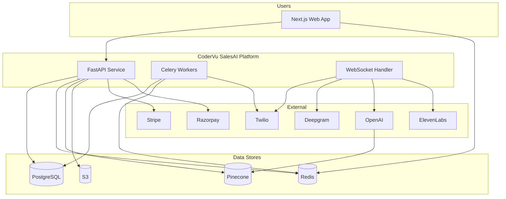
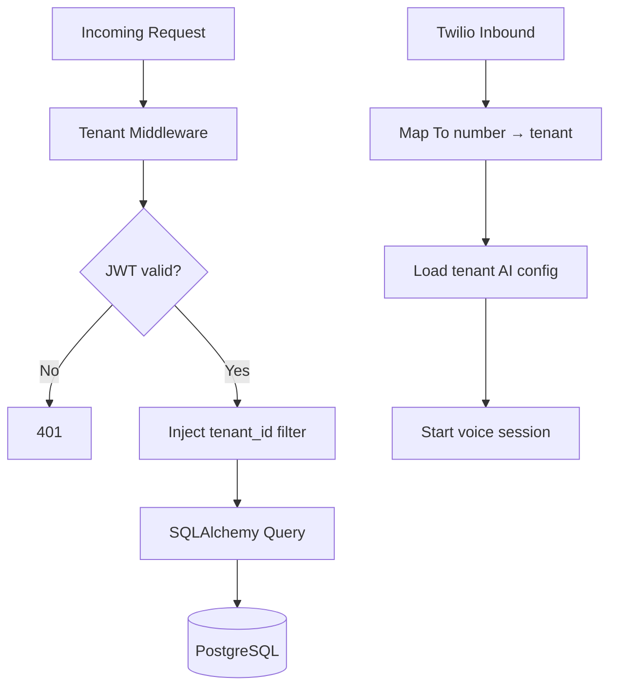

# CoderVu SalesAI — Architecture Overview

**Version:** 1.0

---

## 1. System Context

```mermaid
C4Context
    title System Context - CoderVu SalesAI

    Person(owner as Business Owner)
    Person(manager as Campaign Manager)
    Person(lead as End Lead)

    System(salesai as CoderVu SalesAI)

    System_Ext(twilio as Twilio)
    System_Ext(ai as AI Providers)
    System_Ext(pay as Stripe/Razorpay)

    Rel(owner, salesai, Configures, monitors)
    Rel(manager, salesai, Launches campaigns)
    Rel(salesai, lead, AI voice calls)
    Rel(salesai, twilio, Telephony)
    Rel(salesai, ai, STT/LLM/TTS/RAG)
    Rel(salesai, pay, Billing)
```

---

## 2. Container Diagram



---

## 3. Core Domain Modules

| Module | Responsibility | Key Entities |
|--------|----------------|--------------|
| **Identity** | Auth, RBAC, users | User, Role, Session |
| **Tenant** | Business config | Tenant, Settings |
| **Leads** | CRM records | Lead, ImportBatch |
| **Campaigns** | Dialer config | Campaign, RetryPolicy |
| **Calls** | Session state | Call, Transcript, Recording |
| **AI Config** | Prompt, voice, tools | PromptVersion, VoiceProfile |
| **Knowledge** | RAG documents | Document, Chunk |
| **Billing** | Plans, usage | Subscription, UsageRecord, Wallet |
| **Compliance** | DND, blacklist | BlacklistEntry, AuditLog |

---

## 4. Real-Time Call Path (Logical)

| Step | Component | Action |
|------|-----------|--------|
| 1 | Celery | Dequeue lead, DND check, Twilio dial |
| 2 | Twilio | Answer → open WebSocket to FastAPI |
| 3 | FastAPI WS | Stream audio ↔ Deepgram ↔ GPT-4o ↔ ElevenLabs |
| 4 | FastAPI | Publish events to Redis |
| 5 | Next.js | Subscribe, update live UI |
| 6 | Celery | Post-call: S3 upload, summary, CRM update |

---

## 5. Multi-Tenant Architecture



---

## 6. Deployment Topology (MVP)

| Tier | Service | Notes |
|------|---------|-------|
| Edge | ALB / API Gateway | TLS termination |
| App | ECS/K8s: `api` replicas | WebSocket sticky sessions *recommended* |
| App | ECS/K8s: `worker` replicas | Autoscale on queue depth |
| App | CDN + Node: `web` | Next.js |
| Data | RDS PostgreSQL | Multi-AZ *recommended* |
| Data | ElastiCache Redis | |
| Data | Pinecone SaaS | |
| Object | S3 | Recordings, uploads |

---

## 7. Security Boundaries

| Boundary | Control |
|----------|---------|
| Tenant data | Middleware + ORM scoping |
| Secrets | AWS Secrets Manager / Parameter Store *recommended* |
| Webhooks | Twilio signature validation |
| Payments | Stripe/Razorpay signed webhooks |
| Audio PII | S3 encryption at rest |

---

## 8. Integration Points

| External System | Direction | Purpose |
|-----------------|-----------|---------|
| Twilio | Bi-directional | Calls, audio |
| External CRM | Inbound webhooks *optional* | Tool calls and lead sync via adapter |
| DND Registry | Outbound lookup | Compliance |
| Email provider *recommended* | Outbound | Specialist follow-up emails |

---

*See [08-API-Integration-Spec-Outline.md](./08-API-Integration-Spec-Outline.md) for endpoint contracts.*
