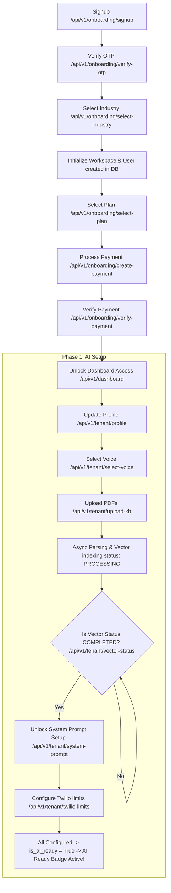

# AI-BOT Backend API 🚀

Welcome to the **AI-BOT Backend**, a production-grade, multi-tenant SaaS backend built using FastAPI and SQLAlchemy. This system supports secure user onboarding, subscription payments, automated document parsing/vectorization, version-controlled system prompts, and ElevenLabs voice configurations.

---

## 🛠️ Technology Stack

The backend is engineered with modern, robust Python technologies:
* **Core Framework:** [FastAPI](https://fastapi.tiangolo.com/) (Asynchronous, high-performance web framework)
* **ORM:** [SQLAlchemy](https://www.sqlalchemy.org/) (with robust multi-tenant model associations)
* **Data Validation:** [Pydantic v2](https://docs.pydantic.dev/latest/) (strict schema validation and parsing)
* **Database Drivers:** PostgreSQL (production) & SQLite (testing and local environments)
* **Third-Party Integrations:**
  * **ElevenLabs API:** Premium AI voice list fetching and selection
  * **Twilio:** Outbound telephony configurations and rate limit safeguards
  * **Pinecone (Simulated):** Vector search indexing using isolated namespaces per tenant
* **Testing:** [Pytest](https://docs.pytest.org/) (integration and lifecycle validation tests)

---

## 📈 Project Status & Completed Work

All phases of core Onboarding and AI Agent Setup are successfully completed and fully covered by automated integration tests.

### ✅ Phase 0: User Onboarding & Payment Flow
1. **Signup & OTP Verification:** Temporary registration token logic with static OTP verification checks.
2. **Tenant Workspace Setup:** Associates registered user with a newly initialized multi-tenant safe Tenant workspace, auto-creating a separate **Wallet** and **TenantUsage** record.
3. **Baseline System Prompt:** Maps a contextual system prompt template based on the chosen industry (e.g., Real Estate).
4. **Subscription Selection:** Links subscription states (`INACTIVE` -> `ACTIVE`) using dynamic plans from the database.
5. **Billing Isolation & Payment:** Uses secure integer cents storage for transaction records. Gated dashboard access is fully enforced until the mock payment completes successfully.

### ✅ Phase 1: Business & AI Agent Setup
1. **Company Profile Settings:** Update details (`company_name`, `website`, `timezone`, etc.) safely.
2. **ElevenLabs Voice Selection:** Fetch premium voice models from ElevenLabs (fetching dynamically from xi-api-key or mock list) and save selection.
3. **Multi-Tenant Document System:**
   * **Upload PDFs:** Upload multiple files, check file types, save locally under the `/uploads` directory, and mount static path serving.
   * **Dynamic File Querying & Deletion:** Retrieve all uploaded files for the tenant, or delete them (removing file from disk and DB).
4. **Asynchronous Vector Indexing:**
   * Uses FastAPI `BackgroundTasks` to parse text and auto-chunk segments into 500-1000 character chunks.
   * Updates `EmbeddingLog` metrics and `TenantUsage` analytics.
   * Evaluates namespaces isolated to each specific `tenant_id`.
5. **Version-Controlled System Prompt:** Locked until vectorization status is `COMPLETED`. Every change increments the `system_prompt_version` history count.
6. **Twilio Limits Configuration:** Restricts max outbound concurrent calls per second to protect API call rate limits.
7. **AI Ready Badge:** Dynamically switches `is_ai_ready` to `True` once a Voice model, System Prompt, and Knowledge Base files are successfully configured.

---

## 🔄 Backend Lifecycle Flow

The following diagram illustrates the complete, step-by-step user onboarding and agent configuration flow:



---

## 🚀 Running the Project

### Environment Setup
1. Clone the project and navigate to the backend directory:
   ```bash
   cd backend
   ```
2. Install dependencies:
   ```bash
   pip install -r requirements.txt
   ```
3. Set your custom credentials in the `.env` file:
   ```env
   elevenlabs=sk_b763f0f601c6b1ed3ca6c9aefc366efe4be30cb98c4d8c89
   twiliokey=KQIvNbZ0uWb0MRLbqnpAUUW1VGJgwPN8
   ```

### Running Server Locally
Start the server using `uvicorn` or the execution script:
```bash
python server.py
```
* Interactive API Documentation (Swagger UI): http://localhost:8000/api/v1/docs

### Running Tests
Execute the complete multi-tenant lifecycle integration tests:
```bash
python -m pytest -s
```
