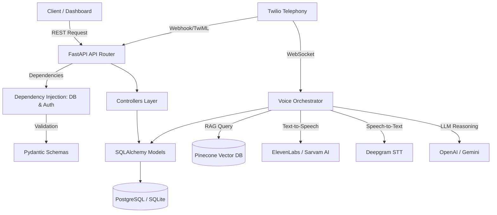
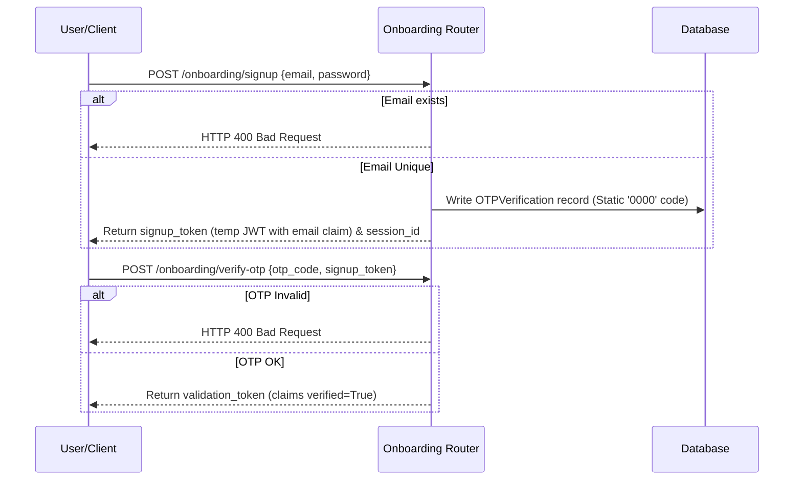
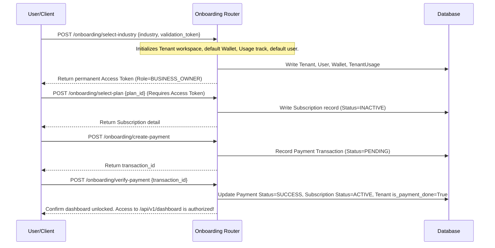
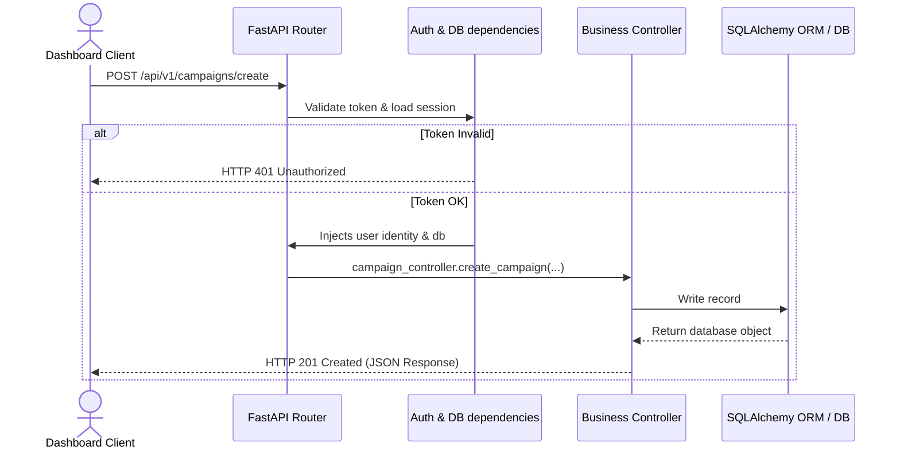
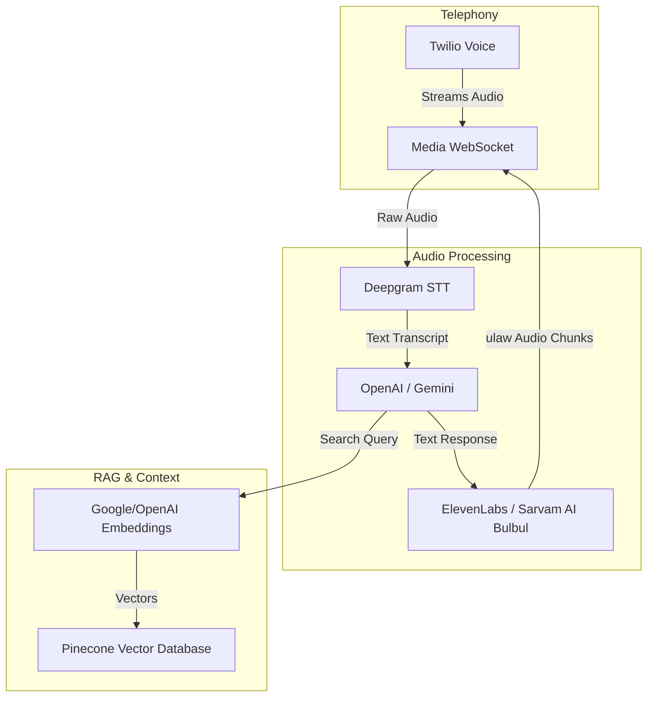
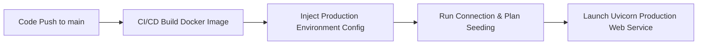

# AI-BOT Backend API System Documentation 🚀

Welcome to the **AI-BOT Backend**, a production-grade, multi-tenant SaaS conversational AI platform built using **Python, FastAPI, and SQLAlchemy**. This system orchestrates outbound automated calling campaigns, real-time audio WebSockets, custom voice model integrations, document vector indexing (RAG), and subscription/billing lifecycles.

---

## 1. Project Overview

### Backend Purpose
This backend provides the REST APIs, WebSockets, and database storage layer for the **AI-BOT SaaS Platform**. Its primary purpose is to enable businesses to launch automated, conversational AI outbound and inbound calling campaigns. 

### Business Problem Solved
Traditional cold-calling and outbound lead nurturing operations are expensive, suffer from high human agent turnover, lack scalability, and yield inconsistent script compliance. **AI-BOT** solves this by:
* **Scale-Out Operations:** Launching hundreds of concurrent calls per second via automated campaigns.
* **Realistic Conversational Interactions:** Delivering natural, human-like voice conversations using state-of-the-art speech synthesis and transcription models.
* **Dynamic Information Lookup (RAG):** Arming calling agents with tenant-specific PDF knowledge bases so they can answer customer queries dynamically.
* **Live Operational Control:** Monitoring calls in real-time on a graphical dashboard, showing live latency diagnostics and transcripts.

### Main Features
* **Multi-Tenant Workspace Isolation:** Secure signup, verification, workspace creation, and database/vector indexing isolation.
* **Subscription & Payment Lifecycle:** Gated registration state transitions with tiered billing packages (Basic, Pro, Enterprise) and credit wallet systems.
* **ElevenLabs & Sarvam AI Voice Integration:** Dynamic voice listing and selective profile allocation.
* **Asynchronous Document Vectorization:** Background parsing of uploaded PDFs, chunking, and namespace-isolated Pinecone vector indexing.
* **Version-Controlled System Prompts:** Structured templates mapped to industry baselines with version history increments.
* **Outbound Telephony & Media Streams:** Bridging Twilio calls to the conversational WebSocket engine for raw audio processing.
* **Live Telemetry & Telemetry Broker:** Pub/Sub streaming of running campaign events and transcript broadcasts.

---

## 2. Technology Stack

The backend is engineered with modern, robust Python technologies:

| Technology | Purpose | Why Used |
| :--- | :--- | :--- |
| **FastAPI** | Core Web Framework | Async-first, high performance, native dependency injection, and automatic OpenAPI schema generation. |
| **Uvicorn** | ASGI Server | Lightweight, ultra-fast production-ready server supporting WebSocket protocols. |
| **SQLAlchemy** | Relational Database ORM | Powerful schema definitions, relationship mapping, and database connection pooling. |
| **PostgreSQL** | Production Database | Enterprise-grade reliability, foreign keys, transaction handling, and cloud host support (Neon). |
| **SQLite** | Local / Testing Database | File-based database allowing rapid prototyping and clean test isolation without dependencies. |
| **Pydantic v2** | Data Validation | Strict runtime schema validation, data serialization, and environment setting parsing. |
| **Redis** | Pub/Sub Message Broker | High-speed cache and message broker for multi-tenant real-time call broadcasts (falls back to memory). |
| **Twilio API** | Telephony Gateway | Globally recognized gateway for managing phone numbers, outbound API triggers, and audio webhooks. |
| **ElevenLabs API** | Text-to-Speech (TTS) | High-fidelity voice synthesis supporting dynamic parameter streams and customization. |
| **Sarvam AI API** | Multilingual TTS | Native Indian language voice models (Bulbul v3) delivering low-latency audio. |
| **Deepgram API** | Speech-to-Text (STT) | Ultra-low latency voice transcription for real-time conversation analysis. |
| **OpenAI / Gemini** | LLM Engine | Reasoning models used to interpret conversation, execute tools, and formulate agent responses. |
| **Pinecone DB** | Vector Database | High-performance search indexing supporting isolated namespaces for multi-tenant RAG. |
| **PyPDF** | PDF Parsing | Lightweight library to extract textual information from knowledge base files. |
| **Pytest** | Testing | Modern testing framework to manage mock files and validate end-to-end user simulation. |
| **Bcrypt & JWT** | Authentication & Security | Industry-standard hashing for passwords and signed state tokens for active user sessions. |

---

## 3. Backend Architecture

The backend implements a clean MVC layer separation built around FastAPI's Dependency Injection pattern.

### Architecture Data Flow


### Explanation of Layers

* **API Router Layer ([app/routes](file:///c:/Users/Admin/Documents/GitHub/ai-bot/backend/app/routes)):** Defines REST endpoints and WebSocket channels. Implements CORS policies, API versioning prefixes (`/api/v1`), and groups API routes by resource.
* **Dependency Injection & Middleware ([app/main.py](file:///c:/Users/Admin/Documents/GitHub/ai-bot/backend/app/main.py)):** Controls request/response filters (CORS, logs). Injects resources per request, such as standard database sessions ([get_db](file:///c:/Users/Admin/Documents/GitHub/ai-bot/backend/app/database/connection.py#L48)) and verified user scopes/tokens.
* **Controllers Layer ([app/controllers](file:///c:/Users/Admin/Documents/GitHub/ai-bot/backend/app/controllers)):** Performs business operations, manages transaction boundaries, triggers integrations, and formats response payloads. Contains [voice_orchestrator.py](file:///c:/Users/Admin/Documents/GitHub/ai-bot/backend/app/controllers/voice_orchestrator.py) which handles raw byte translation.
* **Service/ORM Model Layer ([app/models](file:///c:/Users/Admin/Documents/GitHub/ai-bot/backend/app/models)):** Translates Python classes to database schemas using SQLAlchemy. Standardizes database attributes, timestamps, and relationship mapping.
* **Database Layer ([app/database](file:///c:/Users/Admin/Documents/GitHub/ai-bot/backend/app/database)):** Manages physical engine connections, pooling options, and runs auto-generation/seeding logic.

---

## 4. Complete Folder Structure

The code is organized into a modular structure under `app/`:

```
backend/
├── app/
│   ├── config/              # Environment configurations & application constants
│   │   ├── __init__.py
│   │   └── settings.py      # Pydantic BaseSettings class mapping env variables
│   ├── controllers/         # Logic executors and telemetry orchestrators
│   │   ├── __init__.py
│   │   ├── auth_controller.py
│   │   ├── call_log_controller.py
│   │   ├── campaign_controller.py
│   │   ├── lead_controller.py
│   │   ├── otp_controller.py
│   │   ├── payment_controller.py
│   │   ├── subscription_controller.py
│   │   ├── tenant_controller.py
│   │   ├── user_controller.py
│   │   └── voice_orchestrator.py # WebSocket engine for real-time calls
│   ├── database/            # Connection establishment & default tables seeding
│   │   ├── __init__.py
│   │   └── connection.py    # DB engine creation & get_db generator helper
│   ├── models/              # SQLAlchemy model schemas & relations mapping
│   │   ├── __init__.py      # Groups all tables for metadata initialization
│   │   ├── blacklist.py     # Blacklisted numbers registry
│   │   ├── call_log.py      # Telephony historical summaries and recordings
│   │   ├── campaign.py      # Automated dialers settings
│   │   ├── document.py      # Tenant knowledge base metadata
│   │   ├── embedding_log.py # RAG chunks log metrics
│   │   ├── lead.py          # Customers details database
│   │   ├── otp_verification.py # Signup passcode caches
│   │   ├── payment.py       # Cent-based financial logs
│   │   ├── plan.py          # Packages list (Basic, Pro, Enterprise)
│   │   ├── prompt_version.py# System prompts history logs
│   │   ├── subscription.py  # User tier configurations
│   │   ├── tenant.py        # Workspaces and provider settings
│   │   ├── tenant_usage.py  # Monthly API usage metrics
│   │   ├── tool_schema.py   # AI tool calling schemas
│   │   ├── user_model.py    # User login data & credentials mapping
│   │   └── wallet.py        # Account balances metrics
│   ├── routes/              # FastAPI router files
│   │   ├── __init__.py
│   │   ├── admin_routes.py  # Super admin tools configuration
│   │   ├── auth_routes.py   # Token generation & login actions
│   │   ├── call_log_routes.py # Conversation transcripts accessors
│   │   ├── campaign_routes.py # Campaign execution controls
│   │   ├── lead_routes.py   # CRUD lead data
│   │   ├── live_routes.py   # WebSocket dashboards metrics feeds
│   │   ├── onboarding_routes.py # Setup wizard routes
│   │   ├── telephony_routes.py # Twilio callbacks & voice hooks
│   │   ├── tenant_routes.py  # Settings configurations
│   │   └── user_routes.py   # Internal staff management
│   ├── schemas/             # Pydantic data schemas & validators
│   │   ├── __init__.py
│   │   ├── admin_schema.py
│   │   ├── auth_schema.py
│   │   ├── call_log_schema.py
│   │   ├── campaign_schema.py
│   │   ├── lead_schema.py
│   │   ├── payment_schema.py
│   │   ├── subscription_schema.py
│   │   ├── tenant_schema.py
│   │   └── user_schema.py
│   ├── utils/               # Common helper functions
│   │   ├── __init__.py
│   │   ├── helpers.py       # Password encoders & JWT builders
│   │   └── pubsub.py        # Telemetry broker classes
│   └── main.py              # Root initialization script
├── data/                    # Local file caches
├── uploads/                 # Static path location storing tenant PDFs
├── tests/                   # Automated E2E integration test suite
├── Dockerfile               # Build configuration
├── server.py                # Fast launch executable
├── requirements.txt         # Project package requirements
└── .env                     # Local runtime keys configuration
```

---

## 5. Environment Configuration

The application reads configuration parameters from `.env` using [settings.py](file:///c:/Users/Admin/Documents/GitHub/ai-bot/backend/app/config/settings.py). 

### Configuration Details

| Variable | Purpose | Required/Optional | Security Detail |
| :--- | :--- | :--- | :--- |
| `PROJECT_NAME` | Display title of the application | Optional | Used in Swagger documentation metadata. |
| `DEBUG` | Enables developer mode and relaxed CORS rules | Optional | Must be set to `False` in production to prevent leakage. |
| `DATABASE_URL` | Complete DB connection string | Required | Injected dynamically. Defaults to SQLite in local. |
| `SECRET_KEY` | Symmetric key signing authentication tokens | Required | Must be a long, randomly generated secret in production. |
| `ALGORITHM` | Hashing scheme for JWTs (default: HS256) | Optional | Keep default unless enterprise-level rotation is needed. |
| `ACCESS_TOKEN_EXPIRE_MINUTES` | Lifecycle limit of generated user access token | Optional | Lower values improve security. |
| `CORS_ORIGINS` | JSON list of trusted web origins | Required | Controls browser script requests. Protects backend API access. |
| `OPENAI_API_KEY` | Token for OpenAI LLM and Vector searches | Optional | Grants access to GPT-4o models and text embeddings. |
| `GEMINI_API_KEY` | Token for Google Gemini and Embedding searches | Optional | Preferred fallback provider for voice RAG processing. |
| `ELEVENLABS_API_KEY` | xi-api-key authorizing text-to-speech calls | Optional | Falls back to mocks if empty. Critical for real calls. |
| `SARVAM_AI_KEY` | Token for Sarvam AI Bulbul TTS WebSocket calls | Optional | Critical for real-time low-latency Indian language calls. |
| `DEEPGRAM_API_KEY` | Token for Deepgram STT stream decoding | Optional | Essential for decoding Twilio audio streams into text. |
| `TWILIO_ACCOUNT_SID` | Global Twilio identifier | Optional | Fallback sid if tenant-specific telephony credentials are empty. |
| `TWILIO_AUTH_TOKEN` | Global Twilio credentials secret | Optional | Fallback token authorizing call dialing. |
| `TWILIO_PHONE_NUMBER` | Default outbound calling number | Optional | Fallback outbound number. |
| `REDIS_URL` | Host url connecting to in-memory store | Optional | Power-up caching and horizontal scale of WebSockets. |
| `PUBLIC_CALLBACK_URL` | Callback domain routing Twilio webhooks | Optional | Must match the public HTTPS address mapping to the server. |

### `.env.example` Template
```env
PROJECT_NAME="AI-BOT API"
DEBUG=True
DATABASE_URL="sqlite:///./sql_app.db"
# DB_HOST=localhost
# DB_USER=postgres
# DB_PASSWORD=root
# DB_NAME="AI-BOT API"
SECRET_KEY="your-super-secret-key-for-jwt-token-generation-change-this"
ALGORITHM="HS256"
ACCESS_TOKEN_EXPIRE_MINUTES=30
CORS_ORIGINS=["http://localhost:3000","http://localhost:5173"]

# ── Voice, AI, and Vector Databases (Local Dev / Mock Fallback if Empty) ─────
OPENAI_API_KEY=
GEMINI_API_KEY=
ELEVENLABS_API_KEY=
SARVAM_AI_KEY=
DEEPGRAM_API_KEY=
PINECONE_API_KEY=
PINECONE_INDEX_NAME="ai-bot-index"
REDIS_URL="redis://localhost:6379/0"
PUBLIC_CALLBACK_URL="http://localhost:8000"

# ── Global Twilio Credentials ────────────────────────────────────────────────
TWILIO_ACCOUNT_SID=
TWILIO_AUTH_TOKEN=
TWILIO_PHONE_NUMBER=
```

---

## 6. Database Architecture

The backend supports multiple databases through **SQLAlchemy**. When specific PostgreSQL parameters (`DB_USER`, `DB_PASSWORD`, `DB_HOST`, `DB_NAME`) are supplied in the env, the connection pool will automatically initialize a PostgreSQL engine. If not, it falls back to a local SQLite file (`sqlite:///./sql_app.db`).

### Schema Relationships
```mermaid
erDiagram
    TENANTS ||--o{ USERS : hasMany
    TENANTS ||--o{ CAMPAIGNS : configures
    TENANTS ||--o{ LEADS : owns
    TENANTS ||--o{ PROMPT_VERSIONS : tracks
    TENANTS ||--o{ DOCUMENTS : embeds
    TENANTS ||--o{ EMBEDDING_LOGS : records
    TENANTS ||--o{ BLACKLISTED_NUMBERS : blocks
    TENANTS ||--o1 SUBSCRIPTIONS : maintains
    TENANTS ||--o1 WALLETS : owns
    TENANTS ||--o1 TENANT_USAGES : monitors

    USERS {
        UUID id PK
        UUID tenant_id FK
        VARCHAR username
        VARCHAR email
        VARCHAR role
        BOOLEAN is_active
    }
    
    TENANTS {
        UUID id PK
        VARCHAR company_name
        VARCHAR slug
        VARCHAR company_email
        BOOLEAN is_payment_done
        BOOLEAN is_ai_ready
    }

    CAMPAIGNS ||--o{ CALL_LOGS : generates
    LEADS ||--o{ CALL_LOGS : answers
    CAMPAIGNS }o--o{ LEADS : assigns
    
    CAMPAIGNS {
        UUID id PK
        UUID tenant_id FK
        VARCHAR name
        VARCHAR status
    }
    
    LEADS {
        UUID id PK
        UUID tenant_id FK
        VARCHAR name
        VARCHAR phone
        VARCHAR status
    }
    
    CALL_LOGS {
        UUID id PK
        UUID campaign_id FK
        UUID lead_id FK
        VARCHAR status
        TEXT transcript
    }
```

### Connection and Table Creation Lifecycle
During server startup, the database engine initializes tables if they do not exist:
1. **Target Verification:** The connection script [connection.py](file:///c:/Users/Admin/Documents/GitHub/ai-bot/backend/app/database/connection.py) verifies connectivity.
2. **Auto-Database Creation:** If utilizing PostgreSQL and the target DB is missing, the system boots a connection to the administrative `postgres` DB, issues `CREATE DATABASE`, and switches connection context.
3. **Plan Seeding:** Seeds standard plans (`basic`, `pro`, `enterprise`) into the `Plan` table ([seed_default_plans](file:///c:/Users/Admin/Documents/GitHub/ai-bot/backend/app/database/connection.py#L55)).

---

## 7. Authentication & Authorization System

The authorization system runs on signed JSON Web Tokens (JWT) containing cryptographic session declarations.

### Lifecycle Flows

#### Registration Flow (Onboarding)


#### Selection and Dashboard Unlock Flow


### Role-Based Access Control (RBAC)
Role checking is enforced using FastAPI dependencies. The function [require_role](file:///c:/Users/Admin/Documents/GitHub/ai-bot/backend/app/controllers/auth_controller.py) restricts endpoints:
* `SUPER_ADMIN`: Overall platform control, tenant provisioning, system template modifications.
* `BUSINESS_OWNER`: Access to all features within their Tenant workspace (billing, prompt creation, documents uploads).
* `CAMPAIGN_MANAGER`: Campaign controls, lead lists uploads, analytics access.
* `SALES_REP`: Lead status editing, dashboard viewing.

---

## 8. API Documentation

All endpoints are registered under the `/api/v1` version prefix.

### Onboarding Module
* **POST `/api/v1/onboarding/signup`**
  * *Purpose:* Initiate onboarding. Validates email and creates verification session.
  * *Request:* [UserSignup](file:///c:/Users/Admin/Documents/GitHub/ai-bot/backend/app/schemas/auth_schema.py#L4) `{email: str}`
  * *Response:* `RegisterResponse` containing `signup_token`, `session_id`, and static OTP notice.
  * *Auth:* Public.
* **POST `/api/v1/onboarding/verify-otp`**
  * *Purpose:* Confirm signup email ownership.
  * *Request:* [VerifyOTPRequest](file:///c:/Users/Admin/Documents/GitHub/ai-bot/backend/app/schemas/auth_schema.py#L4) `{signup_token, otp_code}`
  * *Response:* `VerifyOTPResponse` containing `validation_token`.
  * *Auth:* Temp token verified.
* **POST `/api/v1/onboarding/select-industry`**
  * *Purpose:* Initialize the workspace workspace structures.
  * *Request:* [SelectIndustryRequest](file:///c:/Users/Admin/Documents/GitHub/ai-bot/backend/app/schemas/auth_schema.py#L4) `{company_name, industry}`
  * *Response:* Standard Auth `Token` (Access + Refresh tokens).
  * *Auth:* Requires valid validation token.
* **POST `/api/v1/onboarding/select-plan`**
  * *Purpose:* Select initial subscription pricing tier.
  * *Request:* `SelectPlanRequest` `{plan_id}`
  * *Response:* `SubscriptionOut`
  * *Auth:* Authenticated JWT.
* **POST `/api/v1/onboarding/create-payment`**
  * *Purpose:* Initialize invoice request.
  * *Request:* `CreateOrderRequest` `{amount_cents}`
  * *Response:* `CreateOrderResponse`
  * *Auth:* Authenticated JWT.
* **POST `/api/v1/onboarding/verify-payment`**
  * *Purpose:* Complete the payment process and activate subscription.
  * *Request:* `VerifyPaymentRequest` `{payment_id}`
  * *Response:* `PaymentOut`
  * *Auth:* Authenticated JWT.

### Authentication Module
* **POST `/api/v1/auth/login`**
  * *Purpose:* Exchange standard credentials for tokens.
  * *Request:* Form URL encoded `{username, password}`
  * *Response:* `Token` object containing `access_token` and `refresh_token`.
  * *Auth:* Public.
* **POST `/api/v1/auth/refresh`**
  * *Purpose:* Create new access tokens using a refresh token.
  * *Request:* `Token` payload.
  * *Response:* Updated `Token` object.
  * *Auth:* Public (requires valid refresh payload).

### Tenant Settings Module
* **PUT `/api/v1/tenant/profile`**
  * *Purpose:* Update details (timezone, timezone settings, website).
  * *Request:* `TenantUpdate` model.
  * *Response:* `TenantOut`
  * *Auth:* RBAC (Owner/Admin).
* **GET `/api/v1/tenant/voices`**
  * *Purpose:* List premium synthetic models from ElevenLabs.
  * *Response:* Array of available voices.
  * *Auth:* Authenticated.
* **POST `/api/v1/tenant/select-voice`**
  * *Purpose:* Lock in the voice choice.
  * *Request:* `VoiceSelectRequest` `{voice_id, voice_provider}`
  * *Response:* `TenantOut`
  * *Auth:* RBAC.
* **POST `/api/v1/tenant/upload-kb`**
  * *Purpose:* Upload PDF files to the workspace's knowledge base.
  * *Request:* Multipart Form Upload (`files: List[UploadFile]`).
  * *Response:* List of uploaded document metadata.
  * *Auth:* RBAC.
* **GET `/api/v1/tenant/vector-status`**
  * *Purpose:* Check RAG pipeline vectorization progress.
  * *Response:* `VectorStatusOut` `{status, pending_chunks, embedded_chunks}`
  * *Auth:* Authenticated.
* **POST `/api/v1/tenant/system-prompt`**
  * *Purpose:* Apply custom voice prompt rules (locked until vector status is `COMPLETED`).
  * *Request:* `SystemPromptRequest` `{prompt_text}`
  * *Response:* `SystemPromptResponse` containing updated version count.
  * *Auth:* RBAC.
* **POST `/api/v1/tenant/twilio-limits`**
  * *Purpose:* Set safety concurrent calling caps.
  * *Request:* `TwilioLimitsRequest` `{max_calls_per_second}`
  * *Response:* `TenantOut`
  * *Auth:* RBAC.

### Lead & Campaign Management
* **POST `/api/v1/leads/import`**
  * *Purpose:* Upload multiple CSV contact rows.
  * *Request:* `LeadImportRequest` (List of objects).
  * *Response:* `LeadImportResponse` containing stats.
  * *Auth:* RBAC.
* **GET `/api/v1/leads/kanban`**
  * *Purpose:* Fetch leads grouped by stage columns.
  * *Response:* `KanbanBoardResponse`
  * *Auth:* Authenticated.
* **POST `/api/v1/campaigns`**
  * *Purpose:* Create dialer campaigns.
  * *Request:* `CampaignCreate` model.
  * *Response:* `CampaignOut`
  * *Auth:* RBAC.
* **POST `/api/v1/campaigns/{campaign_id}/start`**
  * *Purpose:* Boot dialer triggers and begin making calls.
  * *Response:* Success status message.
  * *Auth:* RBAC.

### Telephony WebSocket & Webhooks
* **POST `/api/v1/telephony/outbound-twiml`**
  * *Purpose:* Provide XML layout instructing Twilio to bridge the call to the Media Stream WebSocket.
  * *Query Params:* `campaign_id`, `lead_id`.
  * *Response:* application/xml TwiML output.
  * *Auth:* Public.
* **WS `/api/v1/telephony/media-stream`**
  * *Purpose:* Bidirectional raw audio communication channel connecting directly with Twilio.
  * *Auth:* Private system connection.
* **POST `/api/v1/telephony/status-callback`**
  * *Purpose:* Collect call delivery and duration details.
  * *Auth:* Public callback verification.

---

## 9. Module-Wise Explanation

### Onboarding & Billing Lifecycle
User accounts are locked from accessing the dashboard until payment has been completed.
1. **Industry selection** triggers tenant creation and writes default plans, a wallet, and usage records.
2. The user selects a subscription plan.
3. Secure payment records are generated using standard integers for cents to prevent floating-point issues (e.g. `$29.00` is saved as `2900`).
4. Verifying payment shifts `is_payment_done` to `True` on the `Tenant` model, unlocking dashboard access.

### Knowledge Base & RAG Pipeline
Businesses upload knowledge files to customize their AI agents' context.
* **File Uploads:** Files are saved to the `/uploads` directory and registered in the `Document` database model.
* **Async Parsing:** FastAPI's `BackgroundTasks` executes text extraction (via `PyPDF`) and splits text into logical segments (500–1000 characters).
* **Vector Embeddings:** Generates vector embeddings (using Gemini's `gemini-embedding-001` or OpenAI's `text-embedding-3-small`) and writes them to Pinecone.
* **Security & Separation:** Documents are vectorized using isolated namespaces based on the `tenant_id` to prevent data leakage between tenants.
* **Locking Mechanism:** Prompt updates are disabled while the vectorization process is running to ensure consistent document synchronization.


### Version-Controlled System Prompts
To track prompt performance:
* Changes to prompt text create a new [PromptVersion](file:///c:/Users/Admin/Documents/GitHub/ai-bot/backend/app/models/prompt_version.py) record.
* Incrementing version counts makes rollback operations simple.
* Active prompt texts are saved on the parent `Tenant` record for quick lookups during active calls.

### Telephony & WebSocket Media Streaming
At the core of the calling system is the [voice_orchestrator.py](file:///c:/Users/Admin/Documents/GitHub/ai-bot/backend/app/controllers/voice_orchestrator.py) WebSocket integration.
* **Audio Format:** Telephony calls handle raw audio packets encoded as 8-bit `ulaw` (mu-law) signals at an 8000Hz sample rate.
* **Transcriptions (STT):** Deepgram decodes incoming audio chunks and streams live transcripts.
* **Interruption Handling (Barge-in):** When the customer starts speaking, the orchestrator instantly clears the voice playback buffer, stops current TTS streams, and starts generating a new response.
* **Dynamic AI Prompts:** Integrates the tenant's primary prompt text with contexts retrieved from RAG searches to answer customer questions.
* **Tool Calling:** The calling agent can invoke local database triggers dynamically to schedule follow-ups, calculate premiums, or add numbers to the system blocklist.

---

## 10. Request Lifecycle

### Standard API REST Call


### Real-Time Call Telemetry Stream (WebSockets)
1. **Twilio Media Streaming:** An outbound call is answered. Twilio reads the `/outbound-twiml` endpoint and starts streaming binary audio chunks to the `/telephony/media-stream` WebSocket.
2. **WebSocket Handshake:** The orchestrator opens persistent WebSocket connections to Deepgram (for transcription) and ElevenLabs/Sarvam AI (for text-to-speech).
3. **Conversational Loops:**
   * Incoming audio packets are sent to Deepgram.
   * Deepgram returns text transcription segments.
   * Transcripts are sent to the LLM (OpenAI/Gemini).
   * The LLM streams text tokens.
   * Generated text tokens are sent to ElevenLabs/Sarvam AI.
   * ElevenLabs/Sarvam AI sends back `ulaw` audio frames.
   * Audio frames are packaged as JSON payloads and sent back to Twilio.
4. **Live Dashboard Telemetry:** Diagnostic metrics (such as LLM TTFT, voice delivery latency, and call progress updates) are broadcast to the `/campaigns/{id}/ws` channel using Redis Pub/Sub, updating the monitoring UI in real-time.

---

## 11. Validation System

Data validation is managed using **Pydantic v2** models, which validate incoming request bodies, query parameters, and serialize outbound API payloads.

### Key Validation Features
* **Strict Email Checking:** Validates format using `email-validator`.
* **String Stripping:** Automatically sanitizes input strings to prevent SQL injections and trim leading/trailing whitespace.
* **Clean Slugs:** Generates URL-safe path slugs for onboarding tenants.
* **Custom Models:** Prevents returning passwords or internal API keys to client applications (e.g. using `UserOut` and `TenantMinimalOut` projection schemas).

---

## 12. Error Handling

FastAPI catches internal application errors using custom exception handlers:
* **JSON Exception Serialization:** System exceptions are captured and returned in a standardized format:
  ```json
  {
    "detail": "Error message description details"
  }
  ```
* **Common HTTP Status Code Mappings:**
  * `400 Bad Request`: Input validation failures or business logic errors (e.g. attempting to update a system prompt while vectorization is processing).
  * `401 Unauthorized`: Missing, expired, or invalid authorization headers.
  * `403 Forbidden`: Insufficient role permissions or accessing resource data outside the tenant workspace.
  * `404 Not Found`: Target resource (campaign, lead, document) does not exist in the database.
  * `500 Server Error`: Uncaught application exception.

---

## 13. Security Implementation

* **Password Hashing:** Passwords are encrypted using **Bcrypt** with dynamic salt configurations before database insertion.
* **JWT Signature Checks:** JSON Web Tokens are signed using `HS256` key algorithms, preventing client-side header manipulation.
* **Workspace Data Isolation:** Multi-tenant queries include explicit filters (`tenant_id == current_user.tenant_id`) to prevent data leakage between workspaces.
* **Pinecone Namespace Isolation:** Documents and embeddings are vectorized in distinct namespaces isolated by `tenant_id`.
* **CORS Whitelists:** Origin validation limits cross-origin resource requests to trusted hosts listed in the system settings.

---

## 14. Third Party Integrations



* **Twilio:** Handles inbound/outbound call connections and forwards bidirectional audio streams to the backend server.
* **Deepgram:** Processes real-time audio streams and returns text transcripts.
* **ElevenLabs:** Text-to-speech engine that converts system responses into natural voice streams.
* **Sarvam AI:** Specialized multi-lingual voice engine (Bulbul v3) that generates low-latency Indian language speech audio.
* **OpenAI & Google Gemini:** Evaluates prompt inputs, constructs system contexts, performs tool calls, and generates responses.
* **Pinecone:** Multi-tenant vector store that serves relevant context chunks during RAG searches.

---

## 15. Background Jobs

We utilize FastAPI's built-in `BackgroundTasks` queue to offload resource-intensive file processing tasks from the main thread:
1. **Document Upload:** The user uploads PDF files. The server writes the documents to disk and returns immediately.
2. **Background Processing:** A background task is queued to parse the documents asynchronously:
   * Extracts text from the PDFs.
   * Splits extracted text into chunks.
   * Generates embedding vectors.
   * Saves vectors to Pinecone.
3. **Status Updates:** Updates document processing status fields (`PROCESSING` -> `COMPLETED`/`FAILED`), freeing up workspace prompts once vectorization is complete.

---

## 16. Logging & Monitoring

* **Latency Tracker Diagnostics:** Tracks latency metrics for call turns:
  * *LLM TTFT:* Time from user finishes speaking until LLM returns first text token.
  * *TTS Synthesis Latency:* Time from LLM token generated until synthetic audio stream starts.
  * *Total Turn Latency:* Total time between customer speaking and synthetic response audio playback.
* **Execution Logs:** The server logs background actions, database connections, and external API requests to standard output (`stdout`).
* **Embedding logs:** Database audit trails (`EmbeddingLog` table) track RAG consumption metrics.

---

## 17. Local Development Setup

### Prerequisites
* **Python:** Version `3.10` or higher.
* **Database:** SQLite (built-in) or PostgreSQL server.
* **Redis:** Local server running on port `6379` (optional, falls back to memory).

### Installation
1. Clone the project and navigate to the backend directory:
   ```bash
   cd backend
   ```
2. Build and activate a virtual environment:
   ```bash
   python -m venv venv
   # On Windows:
   venv\Scripts\activate
   # On MacOS/Linux:
   source venv/bin/activate
   ```
3. Install package dependencies:
   ```bash
   pip install -r requirements.txt
   ```

### Running Server
1. Create a `.env` file based on `.env.example` and set your credentials.
2. Launch the local development server:
   ```bash
   python server.py
   ```
3. Open the interactive API documentation (Swagger UI) in your browser:
   * **Swagger UI:** [http://localhost:8000/api/v1/docs](http://localhost:8000/api/v1/docs)
   * **Alternative ReDoc UI:** [http://localhost:8000/api/v1/redoc](http://localhost:8000/api/v1/redoc)

### Running Tests
Run the project's integration and unit test suite:
```bash
python -m pytest -s
```

---

## 18. Deployment Process

### Production Flow


### Docker Deployments
The project includes a [Dockerfile](file:///c:/Users/Admin/Documents/GitHub/ai-bot/backend/Dockerfile) for building containerized applications:
1. **Build the container image:**
   ```bash
   docker build -t ai-bot-backend:latest .
   ```
2. **Run the container container:**
   ```bash
   docker run -d -p 8000:8000 --env-file .env ai-bot-backend:latest
   ```

---

## 19. Testing

* **Framework:** **Pytest** is used for test execution and assert checks.
* **Mock Objects:** Simulates external network APIs (such as ElevenLabs voice list fetches, Pinecone index updates, and OpenAI completions) to run tests in isolation.
* **E2E Simulation:** [test_e2e_simulation.py](file:///c:/Users/Admin/Documents/GitHub/ai-bot/backend/test_e2e_simulation.py) executes end-to-end integration tests:
  * Registers a new tenant and user.
  * Submits mock subscription payments.
  * Uploads sample documents and triggers background vector parsing.
  * Validates calling and agent workspace isolation boundaries.

To run the test suite:
```bash
python -m pytest -v
```

---

## 20. Coding Standards

* **Naming Conventions:**
  * **Variables & Functions:** `snake_case` (e.g. `get_user_by_email`).
  * **Classes:** `PascalCase` (e.g. `CallTurnLatencyTracker`).
  * **Database Tables:** Lowercase pluralized names (e.g. `users`, `tenants`).
* **Folder Rules:** Keep schemas, routes, models, and controllers in their respective modules to maintain a clean codebase structure.
* **JSON Responses:** Use standardized camelCase or snake_case key mappings in Pydantic schemas to ensure clean JSON responses.
* **Git Workflows:**
  * Maintain clean commit messages matching project updates: `feat: add payment verification validation`, `fix: resolve voice playback buffer drop`.

---

## 21. Current Development Status

All phases of onboarding, payment setups, voice selection, background RAG uploads, and custom prompt configurations are complete.

### Completed Features (Phases 0 & 1)
* **Dynamic Workspace Registrations:** OTP validation flows and sandbox tenant database initialization.
* **Subscription Management:** Automated plan database setup and sandbox invoice completion checks.
* **ElevenLabs Integration:** Lists available voice options and saves user selection.
* **RAG Pipeline:** Extracts PDF text, splits text into chunks, and handles namespace-isolated Pinecone indexing.
* **Prompt Versioning:** Tracks and saves prompt adjustments to prevent data loss.
* **Call Control Webhooks:** Generates outbound TwiML callbacks to bridge active calls.

---

## 22. Future Improvements

* **Distributed Pub/Sub Caches:** Transition WebSocket message channels to a clustered Redis backend to scale concurrent connections.
* **Enhanced RAG Chunking:** Implement advanced document semantic layouts and parent-child vector index hierarchies.
* **Advanced Telephony Analytics:** Generate call duration analysis, customer sentiment metrics, and cost calculation summaries.
