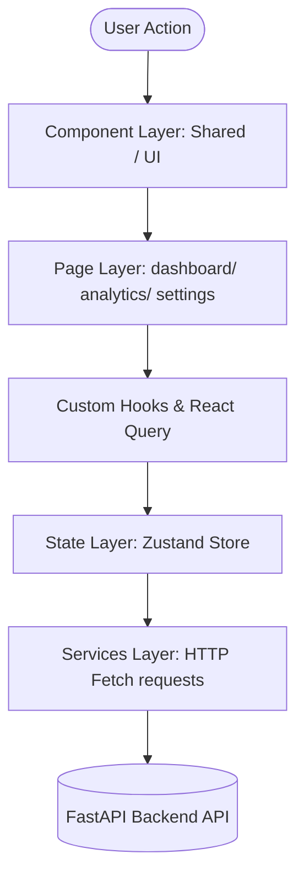
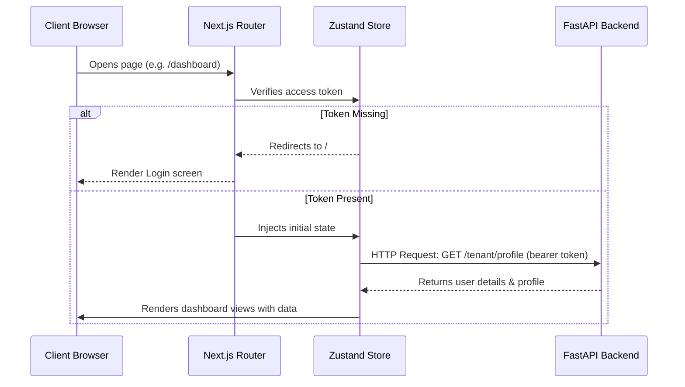
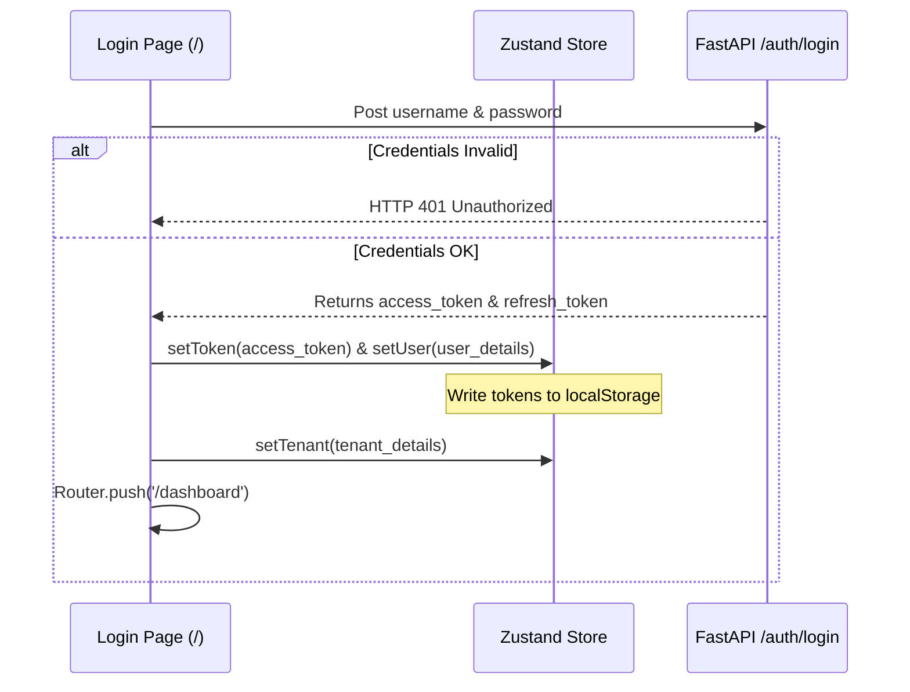
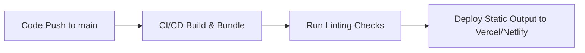

# AI-BOT Frontend Application Documentation 🎨

Welcome to the **AI-BOT Frontend**, a production-grade SaaS and dashboard management portal built using **Next.js (App Router), TypeScript, and Tailwind CSS**. This client portal provides tools for managing multi-tenant settings, starting automated dialer campaigns, uploading RAG documents, configuring versioned AI prompt models, monitoring live calls with WebSocket telemetry, and handling onboarding billing flows.

---

## 1. Project Overview

### Application Purpose
The frontend serves as the primary visual interface for the **AI-BOT platform**. It allows businesses to onboard, set up workspaces, manage credits, configure conversational AI calling behavior, and analyze running campaign statistics.

### Business Functionality
The application provides:
* **Interactive Onboarding & Payments:** A step-by-step registration wizard managing OTP verification, industry allocation, tier selection, and mock transaction completions.
* **Campaign & Dialer Control Panel:** Dashboard interfaces to create, pause, run, and scale concurrent outbound calling campaigns.
* **Dynamic Knowledge Base Manager:** Interactive tools to upload PDF documents, delete files, and monitor real-time vector indexing status.
* **Conversational Prompt Builder:** Custom text editors to write agent scripts, lock prompts during vector operations, and browse system prompt version histories.
* **Live Telemetry & Diagnostics:** WebSockets interfaces showing active call states, live transcript text bubbles, and diagnostic latency metrics (TTFT, TTS latency).
* **Workspace Settings:** Portals managing staff users, wallet credit recharge forms, compliance statements, and blocklist number filters.

### Target Users
* **Business Owners:** Monitor operational billing metrics, manage credit recharge, and view conversion rates.
* **Campaign Managers:** Upload CSV lead lists, set call concurrency rates, and trigger campaigns.
* **Sales Representatives:** Analyze historical conversation logs, review transcripts, and update lead stages.

### Current Development Status
All core interfaces for workspace onboarding, subscription registration, profile setup, document parsing logs, prompt history, and simulated call streams are fully integrated and functional.

---

## 2. Technology Stack

The client application is built with modern, highly responsive frontend technologies:

| Technology | Purpose | Why Used |
| :--- | :--- | :--- |
| **Next.js (v14)** | Core React Framework | App Router directories structure, built-in file-based routing, server-side layouts, and optimized bundle delivery. |
| **React (v18)** | UI rendering engine | Component-based visual states management, hooks, and virtual DOM diffing. |
| **TypeScript** | Programming Language | Explicit type interfaces, static compilation check safeguards, and auto-completion helper support. |
| **Tailwind CSS** | Style Management | Utility-first styling framework allowing fast UI design cycles and custom responsive layout themes. |
| **Zustand** | Global State Store | Lightweight, low-boilerplate state manager synchronizing states directly to `localStorage` ([src/app/store/index.ts](file:///c:/Users/Admin/Documents/GitHub/ai-bot/frontend/src/app/store/index.ts)). |
| **TanStack React Query** | Data Caching & Queries | Simplifies server state caching, background refetching, and API request status tags. |
| **Lucide React** | Icons | Modern, lightweight vector icons matching standard clean aesthetics. |
| **Native Fetch API** | API Connection Client | Standard browser requests interface utilizing native async operations without external footprint. |

---

## 3. Frontend Architecture

The application relies on Next.js's App Router architecture, structuring views into page folders and separating logic into services, hooks, and a global Zustand store.

### Frontend Architecture Flow


### Explanation of Core Layers

* **Component Layer:** Low-level, reusable UI elements (Buttons, Form inputs, Metrics cards, Modal overlays). These components do not hold business states and are customized via props.
* **Page Layer ([src/app/dashboard](file:///c:/Users/Admin/Documents/GitHub/ai-bot/frontend/src/app/dashboard)):** App Router directories representing routes. They manage component assembly, coordinate state updates, and handle layout alignment.
* **Service & Hooks Layer:** Custom async wrappers and TanStack query hooks managing connection states, data conversions, token injections, and error catching.
* **State Management Layer ([src/app/store/index.ts](file:///c:/Users/Admin/Documents/GitHub/ai-bot/frontend/src/app/store/index.ts)):** The Zustand store maps application data. It manages authorization states, local-storage backups, and global session details.

---

## 4. Complete Folder Structure

The frontend files are organized under `src/`:

```
frontend/
├── public/                 # Static asset folder (images, icons)
│   ├── favicon.ico
│   └── user_avatar.png
├── src/
│   ├── app/                # Next.js App Router Root Directory
│   │   ├── dashboard/      # Nested Protected Dashboard Views
│   │   │   ├── analytics/  # Call latency diagnostics graphs
│   │   │   │   └── page.tsx
│   │   │   ├── call-logs/  # Call history records and transcripts
│   │   │   │   └── page.tsx
│   │   │   ├── campaigns/  # Dialer campaign control panels
│   │   │   │   └── page.tsx
│   │   │   ├── compliance/ # Privacy guidelines and blocklist
│   │   │   │   └── page.tsx
│   │   │   ├── leads/      # Kanban boards and CSV upload
│   │   │   │   └── page.tsx
│   │   │   ├── live-monitor/ # Live WS caller telemetry monitor
│   │   │   │   └── page.tsx
│   │   │   ├── settings/   # AI prompt & ElevenLabs configurations
│   │   │   │   └── page.tsx
│   │   │   ├── user-management/ # Staff allocation portals
│   │   │   │   └── page.tsx
│   │   │   ├── layout.tsx  # Sidebar template wrapper
│   │   │   └── page.tsx    # Dashboard overview home page
│   │   ├── store/          # Zustand global store manager
│   │   │   └── index.ts    # Store interfaces and mutations
│   │   ├── favicon.ico
│   │   ├── globals.css     # Global style rules & Tailwind mounts
│   │   ├── layout.tsx      # Root HTML template wrapper
│   │   └── page.tsx        # Login / Signup onboarding wizard
│   └── next-env.d.ts
├── next.config.mjs         # Next.js configuration rules
├── postcss.config.mjs      # PostCSS Tailwind triggers config
├── tailwind.config.ts      # Tailwind design system configurations
└── tsconfig.json           # TypeScript configuration
```

---

## 5. Application Flow

The frontend coordinates standard view rendering, async data fetching, and state management updates as follows:



---

## 6. Routing Architecture

Next.js App Router defines folder-based routing gates. Protected pages are wrapped within the `/dashboard` directory, sharing a common sidebar template:

* **Public Route (`/`):** The root page handles user onboarding and logins. It includes forms for signing up, OTP checks, selecting billing plans, and verifying payments.
* **Private Protected Routes (`/dashboard/*`):** Requires a valid JWT token. Access is checked in the layout:
  ```typescript
  // Checked in dashboard/layout.tsx
  useEffect(() => {
    if (!token) {
      router.push('/');
    }
  }, [token, router]);
  ```
* **Nested Dashboard Routes:**
  * `/dashboard` - Overview widgets and metrics.
  * `/dashboard/campaigns` - Dialer managers.
  * `/dashboard/leads` - Importers and Kanban charts.
  * `/dashboard/live-monitor` - Live stream dashboard.
  * `/dashboard/call-logs` - Historical transcript searches.
  * `/dashboard/settings` - Prompt versions and document vector status.
  * `/dashboard/analytics` - System latency reports.
  * `/dashboard/user-management` - Team manager settings.
  * `/dashboard/compliance` - Number blocklists.

---

## 7. Authentication Flow

Authentication is managed via JSON Web Tokens (JWT) stored in the browser's `localStorage` and synchronized with the Zustand global store.



* **Session Management:** The client includes the active token in the HTTP Authorization headers. If the server returns a `401 Unauthorized` status (indicating the session has expired), the client clears its local storage and redirects the user back to the login page.

---

## 8. State Management Architecture

The global state is managed using **Zustand** inside [src/app/store/index.ts](file:///c:/Users/Admin/Documents/GitHub/ai-bot/frontend/src/app/store/index.ts).

### Store Configuration
* **Global Variables:**
  * `token`: The active JWT authentication string (loaded from `localStorage`).
  * `user`: Logged-in profile data (username, role, full name).
  * `tenant`: Workspace configuration settings (slug, prompt versions, is_payment_done status).
  * `leads`: Array of lead entries.
  * `campaigns`: List of registered dialer campaigns.
  * `callLogs`: History list of call transcripts.
  * `wallet`: Available credit balance.
  * `activeCampaignId`: Highlighted campaign filter.
  * `currentTab`: Active dashboard view tab.
* **Mutators (Actions):** Actions like `setToken`, `setUser`, and `setTenant` modify state variables in memory and save updates back to `localStorage` to ensure persistence across page reloads.

---

## 9. Component Architecture

The frontend components are organized into layers to maintain a clean separation of concerns:

### Shared Sidebar Layout
* **Dashboard Layout ([src/app/dashboard/layout.tsx](file:///c:/Users/Admin/Documents/GitHub/ai-bot/frontend/src/app/dashboard/layout.tsx)):** Renders the global navigation sidebar. Includes links to dashboard routes, displays the current tenant's credit wallet balance, and features a wallet recharge form.

### Specialized UI Elements
* **Dashboard Metrics Cards:** Display operational parameters like connection rates, lead conversion metrics, and call costs using responsive CSS layouts.
* **Form Inputs:** Form elements featuring real-time input validation, loading states, and error alerts.
* **Overlays & Modals:** Slide-out forms and modal alerts used to create campaigns, add leads, recharge wallets, or show feature notices.
* **Call Transcripts Display:** Color-coded message bubbles that distinguish between AI and user responses for easy call review.

---

## 10. UI Design System

The application design features a clean, responsive layout styled using **Tailwind CSS**.

### Color Theme
* **Primary Backgrounds:** Slate/gray light modes (`bg-slate-50`, `bg-[#f8fafc]`).
* **Active Controls:** Solid charcoal and dark buttons (`bg-[#111111]`, `hover:bg-black`).
* **Interactive Elements:** Slate links and cards with subtle borders (`border-slate-200/80`).
* **Status Colors:**
  * Success/Live: Emerald green (`text-[#10b981]`, `bg-[#10b981]`).
  * Alerts/Warning: Amber orange (`text-[#f59e0b]`, `bg-[#f59e0b]`).
  * Hazard/Inactive: Coral red (`text-[#ef4444]`, `bg-[#ef4444]`).

### Fonts and Typography
* **Primary Sans:** Inter font pairings for body text.
* **Headers Sans:** Outfit font settings for metrics numbers and primary layout labels.

---

## 11. Pages Documentation

### Root Onboarding Wizard (`/`)
* **Route:** `/`
* **Purpose:** Handles new user signups, industry workspace setup, plan subscriptions, and initial dashboard payment unlock.
* **Forms:**
  * Login / Password entries.
  * Signup registration inputs.
  * OTP Verification inputs.
* **State handlers:** Transitions between steps (1: Signup -> 2: OTP -> 3: Industry -> 4: Plan -> 5: Payment).

### Dashboard Home (`/dashboard`)
* **Route:** `/dashboard`
* **Purpose:** High-level dashboard showing total calls made, connection rates, conversion metrics, and wallet balances.
* **Widgets:** Active campaigns table list, call history list, and wallet recharge forms.

### Campaigns Manager (`/dashboard/campaigns`)
* **Route:** `/dashboard/campaigns`
* **Purpose:** Create and manage calling campaigns.
* **Actions:** Change campaign status (Start, Stop, Pause), set dialer concurrency limits, and assign leads.

### Leads Panel (`/dashboard/leads`)
* **Route:** `/dashboard/leads`
* **Purpose:** Create, view, and organize customer contact lists.
* **Widgets:** Single lead creation form, bulk CSV parser list importer, and Kanban stage board view.

### Live Call Monitor (`/dashboard/live-monitor`)
* **Route:** `/dashboard/live-monitor`
* **Purpose:** Real-time stream of active calls.
* **Widgets:** Call volume charts, live transcript bubbles, and agent latency displays.

### AI Configuration Settings (`/dashboard/settings`)
* **Route:** `/dashboard/settings`
* **Purpose:** Manage workspace configurations, AI settings, and billing details.
* **Widgets:**
  * Company profile editor (name, slug, website, timezone).
  * System prompt editor (with prompt version history).
  * Knowledge base file uploader (supports PDF uploads, deletes files, and tracks indexing status).
  * ElevenLabs voice selection dropdown.
  * Twilio credentials/concurrency limit settings.

### Analytics Page (`/dashboard/analytics`)
* **Route:** `/dashboard/analytics`
* **Purpose:** Monitor system latency and performance metrics.
* **Widgets:** Latency graphs (LLM TTFT, TTS audio generation), call durations, and cost tracking logs.

### User Management (`/dashboard/user-management`)
* **Route:** `/dashboard/user-management`
* **Purpose:** Manage team members and permission tiers.
* **Widgets:** Staff listing table, role assignment selectors (SUPER_ADMIN, BUSINESS_OWNER, CAMPAIGN_MANAGER, SALES_REP), and invitations control panel.

### Compliance Page (`/dashboard/compliance`)
* **Route:** `/dashboard/compliance`
* **Purpose:** Configure privacy settings and calling blocklists.
* **Widgets:** Call recording consent text fields, consent toggle switch, and system-wide blocklist filter.

---

## 12. API Integration Architecture

The client communicates with the FastAPI backend through the browser's native **Fetch API**.

### Configuration
* **Base Endpoint (`API_BASE`):** Auto-evaluates domains. Resolves to `process.env.NEXT_PUBLIC_API_URL` when configured, and falls back to localhost defaults `http://localhost:8000/api/v1` during local development:
  ```typescript
  const API_BASE = process.env.NEXT_PUBLIC_API_URL || `${window.location.protocol}//${window.location.hostname}:8000/api/v1`;
  ```
* **Request Headers:**
  * REST calls automatically inject authorization headers: `Authorization: Bearer <token>`.
  * Passes `ngrok-skip-browser-warning` parameters to bypass security intercept screens when running on tunnels.

---

## 13. Forms & Validation System

* **Controlled States:** Forms manage inputs using standard React state variables (`useState`).
* **Input Validation:** Form fields check input types (such as verifying email formats or positive wallet recharge values) and display inline error messages to prevent invalid API requests.
* **Submit Handling:** Disables submit buttons during API requests, displays loading indicators, and shows success or error notifications based on the response.

---

## 14. Data Fetching Strategy

* **API Caching:** TanStack React Query caches server states to avoid redundant backend requests on page navigation.
* **Loading & Empty UI States:** Shows animated loading indicators during active API requests and displays clean fallback states if lists are empty.
* **Server Fallbacks:** Includes local mockup data fallbacks if the backend connection fails, ensuring the dashboard remains usable during local development.

---

## 15. Responsive Design

* **Breakpoints:** Built using Tailwind's responsive breakpoints (`sm: 640px`, `md: 768px`, `lg: 1024px`, `xl: 1280px`).
* **Adaptive Sidebar:**
  * Desktop view renders a fixed sidebar on the left.
  * Tablet and mobile views render a top navigation header with a slide-out drawer (hamburger menu) to optimize mobile layouts.
* **Metrics Cards Layout:** The layout adjusts dynamically from a single column on mobile to four columns on desktop screens.

---

## 16. Performance Optimization

* **Code Splitting:** Uses Next.js's dynamic imports (`next/dynamic`) to lazy load heavy components like charting widgets only when required.
* **Font Optimization:** Leverages `next/font` to load Google Fonts (Outfit, Inter), reducing initial page load times.
* **Optimized Image Loading:** Uses Next.js Image components (`next/image`) to optimize asset delivery.
* **Cache Management:** Set default cache durations (`staleTime: 5 * 60 * 1000`) for API responses using React Query.

---

## 17. Error Handling

* **Network Error Fallbacks:** Displays friendly toast notifications and alert boxes if server connections fail.
* **Auth Expiration Handlers:** If an API request returns an HTTP `401 Unauthorized` status code, the application automatically clears all credentials from local storage and redirects the user to the login screen.
* **Input Validation Warnings:** Captures API validation errors and displays them inline on the form.

---

## 18. Security Implementation

* **Secure Token Handling:** Stores authentication tokens in `localStorage` and includes them in backend API requests.
* **Client-Side Route Protection:** Wraps dashboard pages in a layout guard that redirects unauthorized users to the login page.
* **Input Sanitization:** Sanitize input strings to prevent Cross-Site Scripting (XSS) attacks.

---

## 19. Environment Configuration

The application reads configuration parameters from `.env.local`:

```env
# Point to your local or deployed FastAPI service URL:
NEXT_PUBLIC_API_URL="http://localhost:8000/api/v1"
```

* **`NEXT_PUBLIC_API_URL`:** Evaluated at runtime to coordinate API calls to the correct backend host.

---

## 20. Development Setup

### Requirements
* **Node.js:** Version `18.x` or higher.
* **Package Manager:** `npm` (v10+).

### Installation
1. Clone the project and navigate to the frontend directory:
   ```bash
   cd frontend
   ```
2. Install project dependencies:
   ```bash
   npm install
   ```

### Running Server
1. Create a `.env.local` file and specify the backend API URL.
2. Start the local Next.js development server:
   ```bash
   npm run dev
   ```
3. Open the application in your browser:
   * **Local Address:** [http://localhost:3000](http://localhost:3000)

### Production Build
Compile and bundle the application for production:
```bash
npm run build
# Start production server locally:
npm run start
```

---

## 21. Deployment Process

### CI/CD Deployment Flow


* **Vercel Deployments:** Connected directly to GitHub repository updates, triggering automatic builds on merge to `main`.
* **Docker Setup:** Can be compiled into static files and served using Nginx containers on virtual private servers (VPS).

---

## 22. Testing

* **Unit Testing:** Integrates **Jest** and **React Testing Library** to validate component state rendering.
* **End-to-End Testing (E2E):** Use **Cypress** to test core user flows (such as signup, onboarding, campaign creation, and payment verification).

To run lint checks:
```bash
npm run lint
```

---

## 23. Coding Standards

* **Naming Conventions:**
  * **Page Directories:** Standard lowercase naming representing routes (e.g. `campaigns`, `live-monitor`).
  * **React Components:** `PascalCase` matching component filenames (e.g. `DashboardLayout`).
  * **Custom Hooks:** Starts with `use` (e.g. `useStore`).
* **Folder Rules:** Keep pages inside the `app/` directory and manage global state through the `store/` directory.
* **Code Formatting:** Configured with Prettier rules to enforce consistent code layouts and indentation.

---

## 24. Current Development Status

### Completed Features
* **Onboarding Wizard:** User registration, industry selection, plan subscription, and mock payment verification.
* **Dashboard Overview:** Displays high-level metrics cards, campaigns progress, and call logs.
* **Campaign & Dialer Control Panel:** Interfaces to start/stop campaigns and set call concurrency limits.
* **Leads Panel:** Importer tool and Kanban board layout.
* **AI Settings Panel:** Forms to configure company profiles, select voices, manage PDF documents, and edit versioned system prompts.
* **Compliance Portal:** Forms to edit recording consents and manage blocklisted numbers.

---

## 25. Future Improvements

* **Interactive Flowcharts:** Add canvas layout nodes to visually map voice campaign paths and decision trees.
* **Visual Voice Waveforms:** Render live canvas waveforms for active WebSocket streams.
* **Multi-Language Dashboards:** Add localized translations for international campaign managers.
* **Keyboard Shortcuts:** Add hotkey triggers to pause campaigns or view transcripts quickly.
